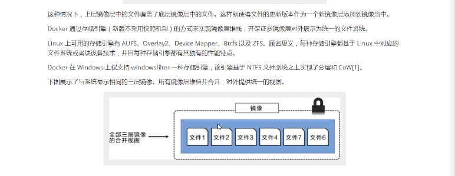
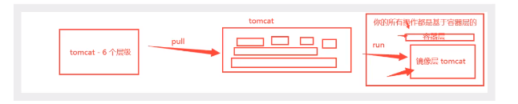
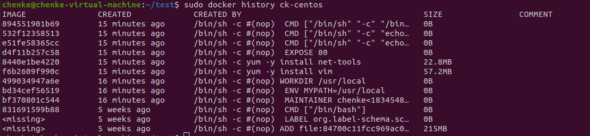
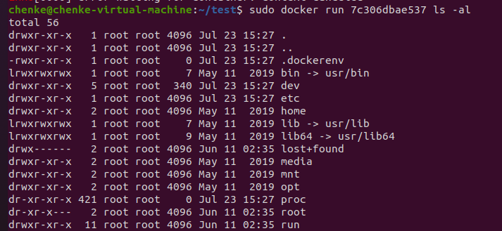
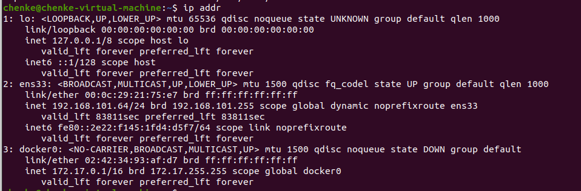
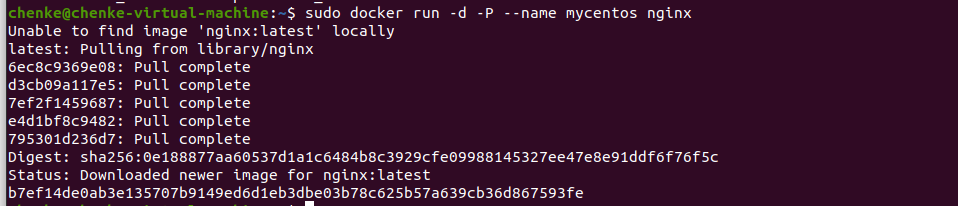
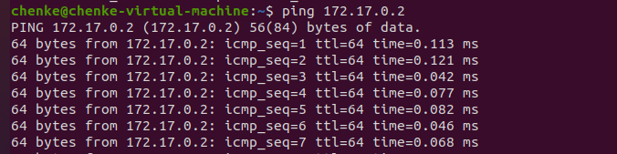
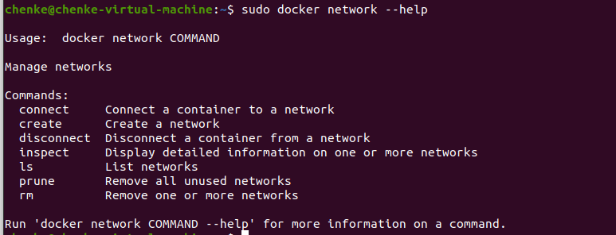

# Docker学习笔记

### 1.docker概述

docker:可以将项目环境一同打包

docker的思想来自于集装箱！

docker的核心思想：隔离

通过隔离机制，可以将服务器利用到极致

*docker出现的本质：因为我们的技术出现了一些问题，我们需要去解决!*

### 2.docker的历史

2010年，几个搞It的年轻人，就在美国成立了一家公司dotCloud,做一些pass的云计算服务！ LXC有关的容器技术！

他们将自己的技术（容器化技术）命名就是Docker!

Docker刚刚诞生的时候，没有引起行业的注意！dotCloud,就活不下去!

开源：开放源代码

2013年， Docker开源！

Docker越来越多的人发现了docker的优点！

在容器技术出现之前，我们都是使用虚拟机技术！


虚拟机：可以虚拟出一台或多台电脑，比较笨重！

docker:隔离，镜像（最核心的环境 4m），十分的小巧，运行镜像就可以了。

到现在，所有开发人员都必须要学习Docker!

### 3. 相关文档

Docker是基于Go语言开发的！开源项目!

官网:  https://www.docker.com/

文档：https://docs.docker.com/

仓库地址：https://hub.docker.com/

### 4.Docker可以做什么

虚拟机技术缺点

1.资源占用十分多

2.冗余步骤多

3.启动很慢

容器化技术

容器化技术不是一个完整的操作系统！

比较docker和虚拟机的不同：

* 传统虚拟机，虚拟出一条硬件，运行一个完整的操作系统，然后在这个系统上安装和运行软件！
* 容器内的应用直接运行在宿主机的内容，容器是没有自己的内核的，也没有虚拟我们的硬件，所以就轻便了
* 每个容器间相互隔离，每个容器都有一个自己的文件系统，互补影响！

DevOps(开发，运维)

**应用更快速的交互和部署**

传统：一堆帮助文档，安装程序

Docker:打包镜像发布测试，一键运行

**更便捷的升级和扩缩容**

使用了Docker之后，我们部署应用就和搭积木是一样的！

项目打包为一个镜像！

**更简单的系统运维**

在容器化之后，我们的开发，测试环境都是高度一致的

**更高效的计算资源利用**

Docker是内核级别的虚拟化，可以在一个物理机上运行很多的容器实例!服务器的性能可以被压缩到极致！

### 5.Docker安装

#### Docker的基本组成


镜像(image）：可以通过这个模板开创建容器服务

容器(container)：Docker利用容器技术，独立运行一个或一组应用，通过镜像来创建的

仓库(repostory)：仓库是存放镜像的地方。

仓库分为共有仓库和私有仓库,默认是国外地址，可以配置国内仓库源！

#### 安装Docker

环境准备:

* 1.需要一点点Linux基础
* 2.Centos系统
* 教学中使用Xshell连接远程服务器进行操作的

环境查看


参考官方手册：https://docs.docker.com/engine/install/

#### 配置阿里云镜像加速

网上有很多，这里就不记载了

#### run的流程和Docker原理


#### 底层原理

Docker是如何运行的？

Docker是一个Client-Server结构的系统，Docker的守护进程运行在主机上,通过Socket从客户端访问!

DockerServer接收到Docker-Client的命令，就会执行这个命令！


**Docker为什么比VM快**？

1.Docker有着比虚拟机更少的抽象层

2.docker利用的是宿主机的内核，vm需要Guest OS


所以说，新建一个容器的时候，docker不需要向虚拟机一样加载也给操作系统内核，避免引导。虚拟机是加载Guest OS,分钟级别的，而docker是利用宿主机的操作系统，省略了这个过程，秒级的！


### 6.Docker的常用命令

帮助命令

```
docker version      #显示docker的版本信息
docker info         #显示docker的系统信息，包括镜像和容器的数量
docker 命令 --help   #docker的帮助命令 
```

帮助文档的地址  https://docs.docker.com/reference/

#### 镜像命令

**docker images**  查看所有本地的主机上的镜像

```
chenke@chenke-virtual-machine:~$ sudo docker images
REPOSITORY          TAG                 IMAGE ID            CREATED             SIZE
nginx               latest              0901fa9da894        9 days ago          132MB

#解释
REPOSITORY    镜像仓库源
TAG           镜像的标签
IMAGE ID      镜像的ID
CREATED       镜像的创建时间
SIZE          镜像的大小

#可选项
-a, --all     列出所有镜像
-q, --quiet   只显示镜像的ID

```

**docker search**   镜像搜索命令

```
chenke@chenke-virtual-machine:~$ sudo docker search --help

Usage:	docker search [OPTIONS] TERM

Search the Docker Hub for images

Options:
  -f, --filter filter   Filter output based on conditions provided
      --format string   Pretty-print search using a Go template
      --limit int       Max number of search results (default 25)
      --no-trunc        Don't truncate output


chenke@chenke-virtual-machine:~$ sudo docker search mysql
NAME                              DESCRIPTION                                     STARS               OFFICIAL            AUTOMATED
mysql                             MySQL is a widely used, open-source relation…   9750                [OK]     
#可选项,通过搜索来过滤
--filter=STARS=3000   #搜索出来的镜像是STARS大于3000的
chenke@chenke-virtual-machine:~$ sudo docker search mysql --filter=STARS=3000
NAME                DESCRIPTION                                     STARS               OFFICIAL            AUTOMATED
mysql               MySQL is a widely used, open-source relation…   9750                [OK]                
mariadb             MariaDB is a community-developed fork of MyS…   3560                [OK]      

```

**docker pull**  镜像名[:tag]       下载镜像

```
如果不写tag，默认下载最新版本的latest
#镜像是分层下载的， docker images的核心  联合文件系统

docker pull mysql
等价于
docker pull docker.io/library/mysql:latest

指定版本下载
docker pull mysql:5.7

```

**docker rmi** 删除镜像

 ````
docker rmi 镜像ID                     #根据ID删除镜像
docker rmi 镜像ID 镜像ID 镜像ID        #可以同时删除多个镜像，空格隔开
docker rmi -f $(docker images -aq)   #将会递归删除所有镜像
 ````


#### 容器命令

**说明:我们有了镜像才可以创建容器，linux,下载一个centos镜像来测试学习**

```
docker pull centos
```

新建容器并启动

```
docker run [可选参数] 镜像ID

# 参数说明
--name="Name"   容器名字
-d              后台运行方式
-it             使用交互方式运行
-p              指定容器的端口  -p 8080:8080
-P              随机指定端口

# 启动并进入容器lssusu
chenke@chenke-virtual-machine:~$ sudo docker run -it centos:centos7.8.2003 /bin/bash
[root@62a767c41c85 /]# 
```

列出所有的运行容器

```
# docker ps 命令
#    查看当前正在运行的容器
# -a 查看所有的容器，包括曾经运行过的


chenke@chenke-virtual-machine:~$ sudo docker ps
CONTAINER ID        IMAGE               COMMAND             CREATED             STATUS              PORTS               NAMES

# 查看所有容器，包括已经退出的容器
chenke@chenke-virtual-machine:~$ sudo docker ps -a
CONTAINER ID        IMAGE                   COMMAND                  CREATED             STATUS                        PORTS               NAMES
62a767c41c85        centos:centos7.8.2003   "/bin/bash"              13 minutes ago      Exited (127) 11 minutes ago                       practical_kalam
1e955f628a31        6d11486a97a7            "docker-entrypoint.s…"   10 hours ago        Exited (1) 10 hours ago                           affectionate_gagarin
a4b5fd8127a1        6d11486a97a7            "docker-entrypoint.s…"   10 hours ago        Exited (1) 10 hours ago                           upbeat_herschel

```

退出容器

```
exit # 容器直接停止并退出
Ctrl + P + Q   容器不停止退出
```

删除容器

```
docker rm 容器ID               # 删除指定容器，不能删除正在运行的容器
docker rm -f $(docker ps -aq) # 删除所有的容器

docker ps -a -q | xargs docker rm # 删除所有的容器
```

启动和停止容器的操作

```
docker start 容器ID     # 启动容器
docker restart 容器ID   # 重启容器
docker stop 容器ID      # 停止容器
docker kill 容器ID      # 杀死容器
```


常用的其他命令

后台启动命令

```
docker run -it -d 镜像ID


docker run -d 镜像ID
当docker ps时，发现centos停止了
原因是缺少 -it    交互方式


```

查看日志

```
docker logs --help

# 查看日志
docker logs -f -t --tail 10 容器ID
```

查看容器中的进程信息

```
docker top 容器ID     # 查看容器内部的进程信息
```

查看镜像的元数据

```
docker inspect --help

docker inspect 镜像ID
chenke@chenke-virtual-machine:~$ sudo docker inspect afb6fca791e0
[
    {
        "Id": "sha256:afb6fca791e071c66276202f8efca5ce3d3dc4fb218bcddff1bc565d981ddd1e",
        "RepoTags": [
            "centos:centos7.8.2003"
        ],
        "RepoDigests": [
            "centos@sha256:8540a199ad51c6b7b51492fa9fee27549fd11b3bb913e888ab2ccf77cbb72cc1"
        ],
        "Parent": "",
        "Comment": "",
        "Created": "2020-05-05T21:20:34.898381457Z",
        "Container": "cf73e3541d0042acd122222f5ba583a378afe39c89f8820d1c4bc652b52297a1",
        "ContainerConfig": {
            "Hostname": "cf73e3541d00",
            "Domainname": "",
            "User": "",
            "AttachStdin": false,
            "AttachStdout": false,
            "AttachStderr": false,
            "Tty": false,
            "OpenStdin": false,
            "StdinOnce": false,
            "Env": [
                "PATH=/usr/local/sbin:/usr/local/bin:/usr/sbin:/usr/bin:/sbin:/bin"
            ],
            "Cmd": [
                "/bin/sh",
                "-c",
                "#(nop) ",
                "CMD [\"/bin/bash\"]"
            ],
            "ArgsEscaped": true,
            "Image": "sha256:7133748183818e21a9ddfeee6924eb854dc684bc037f5d96599eb7a4151326bc",
            "Volumes": null,
            "WorkingDir": "",
            "Entrypoint": null,
            "OnBuild": null,
            "Labels": {
                "org.label-schema.build-date": "20200504",
                "org.label-schema.license": "GPLv2",
                "org.label-schema.name": "CentOS Base Image",
                "org.label-schema.schema-version": "1.0",
                "org.label-schema.vendor": "CentOS",
                "org.opencontainers.image.created": "2020-05-04 00:00:00+01:00",
                "org.opencontainers.image.licenses": "GPL-2.0-only",
                "org.opencontainers.image.title": "CentOS Base Image",
                "org.opencontainers.image.vendor": "CentOS"
            }
        },
        "DockerVersion": "18.09.7",
        "Author": "",
        "Config": {
            "Hostname": "",
            "Domainname": "",
            "User": "",
            "AttachStdin": false,
            "AttachStdout": false,
            "AttachStderr": false,
            "Tty": false,
            "OpenStdin": false,
            "StdinOnce": false,
            "Env": [
                "PATH=/usr/local/sbin:/usr/local/bin:/usr/sbin:/usr/bin:/sbin:/bin"
            ],
            "Cmd": [
                "/bin/bash"
            ],
            "ArgsEscaped": true,
            "Image": "sha256:7133748183818e21a9ddfeee6924eb854dc684bc037f5d96599eb7a4151326bc",
            "Volumes": null,
            "WorkingDir": "",
            "Entrypoint": null,
            "OnBuild": null,
            "Labels": {
                "org.label-schema.build-date": "20200504",
                "org.label-schema.license": "GPLv2",
                "org.label-schema.name": "CentOS Base Image",
                "org.label-schema.schema-version": "1.0",
                "org.label-schema.vendor": "CentOS",
                "org.opencontainers.image.created": "2020-05-04 00:00:00+01:00",
                "org.opencontainers.image.licenses": "GPL-2.0-only",
                "org.opencontainers.image.title": "CentOS Base Image",
                "org.opencontainers.image.vendor": "CentOS"
            }
        },
        "Architecture": "amd64",
        "Os": "linux",
        "Size": 203334579,
        "VirtualSize": 203334579,
        "GraphDriver": {
            "Data": {
                "MergedDir": "/home/chenke/docker/overlay2/9a58372b297f5ee54ac73d3dc27e90fd7c24dacc67e44c7ef85414cc4938a317/merged",
                "UpperDir": "/home/chenke/docker/overlay2/9a58372b297f5ee54ac73d3dc27e90fd7c24dacc67e44c7ef85414cc4938a317/diff",
                "WorkDir": "/home/chenke/docker/overlay2/9a58372b297f5ee54ac73d3dc27e90fd7c24dacc67e44c7ef85414cc4938a317/work"
            },
            "Name": "overlay2"
        },
        "RootFS": {
            "Type": "layers",
            "Layers": [
                "sha256:fb82b029bea0a2a3b6a62a9c1e47e57fae2a82f629b2d1a346da4fc8fb53a0b6"
            ]
        },
        "Metadata": {
            "LastTagTime": "0001-01-01T00:00:00Z"
        }
    }
]

```

进入当前正在运行的容器

```
# 我们通常容器都是使用后台方式运行的，需要进入容器

# 方式一，新开启一个终端进入(常用)
docer exec -it 镜像ID  /bin/bash

# 方式二，进入当前正在执行的终端，不会新开启一个终端
docker attach 镜像ID
```

从容器内拷贝文件到主机中

```
docker cp 镜像ID：/home/test.txt /home/chenke   # 表示从容器内将文件拷贝到 /home/chenke目录下 

#拷贝是一个手动过程，后期会通过-v卷命令来同步数据到主机
```

小结


docker的命令是十分多的，上面我们学习了那些常用的容器和镜像的命令，之后还会学习更多的命令

### 7.作业练习

#### 1.nginx安装

> Docker安装Nginx

```
# 搜索镜像
docker search nginx
# 拉取镜像
docker pull nginx
# 启动nginx
chenke@chenke-virtual-machine:~$ sudo docker run -d --name nginx01 -p 61000:80 nginx
64b994059d214155c6ac520c5b7643192b1b4774ed015b9bff858dd50b5abdb4

# -d  后台运行
# --name 给容器起名字
# -p 暴露端口号  宿主机端口：容器端口

# 查询正在运行的容器
chenke@chenke-virtual-machine:~$ sudo docker ps
CONTAINER ID        IMAGE               COMMAND                  CREATED              STATUS              PORTS                   NAMES
64b994059d21        nginx               "/docker-entrypoint.…"   About a minute ago   Up About a minute   0.0.0.0:61c

# 访问nginx
chenke@chenke-virtual-machine:~$ curl localhost:61000
<!DOCTYPE html>
<html>
<head>
<title>Welcome to nginx!</title>
<style>
    body {
        width: 35em;
        margin: 0 auto;
        font-family: Tahoma, Verdana, Arial, sans-serif;
    }
</style>
</head>
<body>
<h1>Welcome to nginx!</h1>
<p>If you see this page, the nginx web server is successfully installed and
working. Further configuration is required.</p>

<p>For online documentation and support please refer to
<a href="http://nginx.org/">nginx.org</a>.<br/>
Commercial support is available at
<a href="http://nginx.com/">nginx.com</a>.</p>

<p><em>Thank you for using nginx.</em></p>
</body>
</html>

# 说明是成功的
```


思考问题：每次改动nginx配置文件，都必须要进入到容器内部，非常不方便！如果可以直接在外部修改配置就好了

#### 2.tomcat安装

```
# 官方的使用
$ docker run -it --rm tomcat:9.0

# --rm 经常用来测试，表示用完即删除镜像


docker pull tomcat
docekr run -d -p 33333:8080 --name tomcat01 tomcat

```

### 8.可视化

#### portainer

* portainer(先用这个）

  官方文档   https://www.portainer.io/

  ```
  sudo docker run -d -p 9000:9000 -p 8000:8000 --name portainer --restart always -v /var/run/docker.sock:/var/run/docker.sock -v portainer_data:/data portainer/portainer
  ```

  

  什么是portainer?

  Docker图形化界面工具!提供一个后台面板供我们操作

  这里我设置的后台账号密码

  admin @ 123456

  

  
  
  
  
  可视化面板平时不太使用，了解下即可！

### 9.Docker镜像讲解

#### 镜像是什么

镜像是一种轻量级,可执行的独立软件包，用来打包软件运行环境和基于运行环境开发的软件，它包含运行某个软件所需的所有内容，包括代码,运行时,库，环境变量和配置文件。

#### Docker镜像加载原理

> UnionFS（联合文件系统）

我们下载的时候，看到的就是这个！

UnionFS（联合文件系统):Union文件系统(UnionFS)是一种分层,轻量级并且高性能的文件系统，它支持对文件系统的修改作为一次提交来一层层的叠加，同时可以将不同目录挂载到同一个虚拟文件系统下(unite serveral directories into a single virtual filesytem).Union文件系统是Docker镜像的基础。镜像可以通过分层来进行继承，基于基础镜像(没有父镜像)，可以制作各种具体的应用镜像。

特性：一次同时加载多个文件系统，但从外面看起来,只能看到一个文件系统，联合加载会把各层文件系统叠加起来，这样最终文件系统会包含所有底层的文件和目录。


> Docker镜像加载原理

docker的镜像实际上是由一层一层的文件系统组成，这种层级的文件系统UnionFS.

bootfs(boot file system)主要包含bootloader和kernel,bootloader主要是引导加载kernel,Linux刚启动时会加载bootfs文件系统，在Docker镜像的最底层是bootfs.这一层与我们典型的Linux/Unix系统是一样的。包含boot加载器和内核。当boot加载完成之后整个内核就都在内存中了,此时内存的使用权已有bootfs转交给内核，此时系统也会卸载bootfs.

rootfs(root file system),在bootfs之上。包含的就是典型的Linux系统中的/dev,/proc,/bin,/etc等标准目录和文件.rootfs就是各种不同的操作系统发行版，比如Ubuntu,Centos等等。


平时我们安装的centos都好几个G,为什么docker这里才200多兆？

对于一个精简的OS,rootfs可以很小，只需要包含最基本的命令，工具和程序库就可以了，因为底层直接用Host的kernel,自己只需要提供rootfs就可以了。由此可见对于不同的linux发行版，bootfs基本是一致的。rootfs基本上是一致的。rootfs会有差别，因此不同的发行版可以公用bootfs.

#### 分层理解




> 特点

Docker镜像都是只读的，当容器启动时，一个新的可写层被加载到镜像的底部！

这一层就是我们通常说的容器层，容器之下的叫镜像层。



如何提交一个自己的镜像

#### commit镜像

```
docker commit 提交容器成为一个新的副本

docker commit -m="提交的描述信息" -a="作者信息" 容器ID 目标镜像名[:TAG]


```

学习方式说明：理解概念，但是一定要实践，最后实践和理论相结合，一次搞定这个知识！

```
如果想要保存当前容器的状态，就可以通过commit来提交，获得一个镜像。就好比之前学习VM的时候，快照！
```

### 10.容器数据卷

#### 什么是容器数据卷

**docker的理念回顾**

将应用和环境打包成一个镜像！

数据？如果数据都放在容器中，那么我们容器删除，数据就会丢失！<font color=#FF0000>需求：数据持久化</font>

Mysql，容器删了，删库跑路！<font color="#FF000">需求：Mysql数据可以存储在本地</font>

容器之间可以有一个数据共享的技术！Docker容器中产生的数据，同步到本地！

这就是卷技术！目录的挂载，将我们容器内的目录，挂载到Linux上面！


**总结一句话：容器的持久化和同步操作！容器间也是可以数据共享的！

#### 使用数据卷

> 方式一:直接使用命令来挂载 -v

```
docker run -it -v 主机目录:容器内目录

chenke@chenke-virtual-machine:~/test$ sudo docker run -it -v /home/chenke/test:/home afb6fca791e0 /bin/bash 
[root@2b38375aa224 /]# cd /home/
[root@2b38375aa224 home]# ls
a.jpg  koututest3.py

```


再来测试

1.停止容器

2.在主机上修改文件

3.开启容器

4.发现容器内的数据还是同步的


好处：我们以后修改只需要在本地修改即可，容器内会自动同步！

#### 实战：安装MySQL

思考：MySQL的持久化问题？

```
# 搜索镜像
sudo docker search mysql
# 安装镜像
sudo docker pull mysql:5.7
# 挂载数据

chenke@chenke-virtual-machine:~/test$ sudo docker run --name mysql01 -d -e MYSQL_ROOT_PASSWORD=123456 -p 63000:3306 -v /home/chenke/test/mysql:/etc/mysql/conf.d -v /home/chenke/test/data:/var/lib/mysql mysql:5.7
4bdd8c6cbd7cd88f2402b10e9dd9c070297ae3d2320fbf331ba9ab80da28ca14

试了下，本地直接连接没有连接成功，root没有权限，需要修改配置文件
chenke@chenke-virtual-machine:~/test$ mysql -u root -p 63000 
Enter password: 
ERROR 1045 (28000): Access denied for user 'root'@'localhost' (using password: YES)

```

#### 具名挂载和匿名挂载

```
# 匿名挂载
-v 容器内路径
chenke@chenke-virtual-machine:~/docker$ sudo docker run -d -P --name nginx01 -v /home nginx:latest
1c86f340ddabe6107a873abfd87a152c6da5efcd35cd7c049e225d9d95d7699f
不指定主机的路径，就是匿名挂载

# 帮助文档
docker volume --help
chenke@chenke-virtual-machine:~/docker$ sudo docker volume --help

Usage:	docker volume COMMAND

Manage volumes

Commands:
  create      Create a volume
  inspect     Display detailed information on one or more volumes
  ls          List volumes
  prune       Remove all unused local volumes
  rm          Remove one or more volumes

# 查看有哪些卷
```


匿名挂载，名字就像上面那样的乱码

```
# 这是一个具名挂载，就是给挂载卷起了个名字，注意：这里不是路径的映射
chenke@chenke-virtual-machine:~/docker$ sudo docker run -d -P --name nginx02 -v juming_nginx:/home nginx:latest 
38d7c02e9efd0b819890e8be39e886f72d110bf9513f587f600dafe035bd3f78

```

```
# 查看挂载卷信息
docker volume inspect 具名名称
```


所有的docker容器内的卷，没有指定目录的情况下，默认都在`/var/lib/dockeer/volume`目录下，如果自定义存储位置，则在相应的位置

```
#如何确定是具名挂载还是匿名挂载，还是指定路径挂载？
-v 容器内路径           # 匿名挂载
-v 卷名：容器内路径      # 具名挂载
-v /宿主机路径：容器内路径 # 指定路径挂载
```

拓展：

```
# 通过 -v 容器内路径:ro|rw 来改变读写权限
docker run -d -P --name nginx01 -v juming1_nginx:/etc/nginx:ro nginx:latest       #只读,readonly
docker run -d -P --name nginx01 -v juming1_nginx:/etc/nginx:rw nginx:latest       #可读可写， readwrite

# 一旦这个设置了容器权限，容器对我们挂载出来的内容就有限定了！
# ro,说明这个文件只能通过宿主机来操作了
```

#### 初识DockerFile

DockerFile是用来构建docker镜像的构建文件！命令脚本!先体验一下！

镜像文件是一层一层的，所以命令也是一条一条的，每个命令都是一层！

```
# 创建一个dockerfile文件，名字可以随机，建议 Dockerfile

FROM centos

VOLUME ["volume01","volume02"]

CMD echo "------end------"

CMD /bin/bash  

#上面的每个命令，都是一层


#执行构建命令
# -f 脚本文件路径
# -t 生成镜像名称
# 最后一个参数， 上下文路径，是指 docker 在构建镜像，有时候想要使用到本机的文件（比如复制），docker build 命令得知这个路径后，会将路径下的所有内容打包。
如果未说明最后一个参数，那么默认上下文路径就是 Dockerfile 所在的位置。

docker build -f dockerfile1 -t ck/centos .
```


启动自己的镜像


通过 `docker inspect`命令，查看匿名挂载卷所在的路径


这种方式我们未来使用的十分多，因为我们通常会构建自己的镜像！

假设构建镜像时没有挂载卷，要手动镜像挂载 `-v 卷名：容器内路径`

#### 数据卷容器

思考:多个mysql同步数据！


```
volumes-from       # 从指定的容器挂载卷   
```

```
# 启动3个镜像，通过我们刚才自己写的镜像启动
```


```
# Ctrl + p + q      退出后在后台继续运行

# 依次再创建两个容器
```


```
上一步中,在docker02容器内volume01目录下新建了一个文件，这个文件会自动同步到docker01容器对应挂载卷下
```


进入docker01容器中，发现确实存在了这个文件！

创建第3个容器docker03，挂载到父容器docker01


在docker03中创建一个文件，结果docker01,docker02都被同步了!

``` 
# 测试 删除父容器docker01,验证docker02,docker03数据是否还在
```


结论：删除父容器docker01后，docker02,docker03挂载卷里的数据还存在，这样就实现了数据的持久化!

```
# 测试  删除了父容器，剩下的docker02和docker03中挂载卷数据还会继续同步吗？
```


实践证明：删除父容器的情况下，其他相关联的容器内的挂载卷的数据仍然会同步！


多个mysql之间的数据共享！

结论：

容器之间配置信息的传递，数据卷容器的的生命周期一直持续到没有容器使用它为止。

但是一旦你数据持久化，那么本地的数据是不会被删除的

### 11.DockerFile

dockerfile是用来构建docker镜像的文件，命令参数脚本！

构建步骤：

1.编写一个dockerfile文件

2.docker build构建一个镜像

3.docker run 运行环境

4.docker push 发布镜像(dockerhub, 阿里云镜像仓库)


查看官方是如何编写的


任意点击一个标签进入


可以看到链接的文件其实是一个dockerfile文件，里面是一些镜像的构建命令

很多官方的镜像都是基础包，很多功能都没有，我们通常会搭建自己的镜像！

官方既然可以制作镜像，我们也可以！

#### DockerFile构建过程

**基础知识：**

1.每个保留关键字(指令)都必须是大写字母

2.执行从上到下的顺序

3.# 表示注释

4.每一个指令都会创建提交一个新的镜像层，并提交


dockerfile是面向开发的，我们以后要发布项目，做镜像，就需要编写dockerfile文件，这个文件十分简单!

Docker镜像逐渐成为企业交付的标准，必须要掌握!

DockerFile:构建标准，定义了一切步骤，源代码

DockerImages:通过dockerFile构建生成的镜像，最终发布和运行的产品

Docker容器：容器就是镜像运行起来提供服务

#### DockerFile的指令

以前的话都是使用别人的，现在开始自己尝试构建镜像

```
FROM        # 基础镜像，一切从这里开始
MAINTAINER  # 镜像是谁写的：  姓名+邮件
RUN         # 镜像构建时需要运行的命令
ADD         # 步骤，tomcat镜像，这个tomcat压缩包，添加内容
WORKDIR     # 镜像的工作目录
VOLUME      # 挂载的目录
EXPOSE      # 保留端口配置
CMD         # 指定这个容器启动时要执行的命令，只有最后一个会生效，可被替代
ENTRYPOINT  # 指定这个容器启动的时候要运行的命令，可以追加命令
ONBUILD     # 当构建一个被继承 DockerFile这个时候就会运行 ONBUILD的指令，触发指令
COPY        # 类似ADD,将我们的文件拷贝到镜像中
ENV         # 构建的时候设置环境变量
```


#### 实战测试

Docker Hub中 99%的镜像都是从基础镜像过来的 FROM scratch,然后配置需要的软件和配置来进行的构建。


> 创建一个自己的centos镜像
>
> dockerfile2
>
> ```
> FROM centos
> MAINTAINER chenke<1834548723@qq.com>
> ENV MYPATH /usr/local
> WORKDIR $MYPATH
> 
> RUN yum -y install vim
> RUN yum -y install net-tools
> 
> EXPOSE 80
> 
> CMD echo $MYPATH
> CMD echo "-----end---"
> CMD /bin/bash
> ```
>
> 执行构建命令
>
> ```
> # -f 要构建的脚本路径
> # -t 生成的镜像name名称
> # .    最后的一个点是上下文的意思，必须要添加
> 
> docker build -f dockerfile2 -t ck-centos .
> ```
>
> 我们可以列出本地进行的变更历史,查询该镜像是如何构建的
>
> ```
> docker history 镜像ID
> ```



我们平时拿到一个镜像，可以研究一下他是怎么做的


> CMD和ENTRYPONT 区别

```
CMD         # 指定这个容器启动时要执行的命令，只有最后一个会生效，可被替代
ENTRYPOINT  # 指定这个容器启动的时候要运行的命令，可以追加命令
```

举例如下：

```
# 创建一个cmd_dockerfile，使用CMD指令
FROM centos
CMD ls -a

# 执行构建命令
docker build -f cmd_dockerfile -t cmd_test_centos
```


此时想要在后面追加个参数查看详情，报错如下：


原因是：通过CMD指令构建的语句，后面添加参数时，会将原有的指令给替换掉，

效果类似于只剩下    `-l`,所以报错！

必须写完整指令才行




```
# 创建一个cmd_dockerfile，使用ENTRYPOINT指令
FROM centos
ENTRYPOINT ls -a

# 执行构建命令
docker build -f cmd_dockerfile -t cmd_test_centos
```


运行容器


查看详情


此时就不会报错


Docker中很多命令都十分的相似，我们最好的学习就是对比他们，然后测试效果!

#### 实战：DockerFile制作tomcat镜像

待补充

#### 发布镜像到DockerHub

> DockerHib

1.地址：https://hub.docker.com/  注册自己的账号

2.确定这个账号可以登陆

3.在我们服务器上提交自己的镜像


4.登陆完毕后，就可以提交镜像了 就是一步  `docker push`

```
docker push 用户名/镜像名称[:版本号]
```

**附注：给镜像打标签**

```
docker tag 镜像ID 镜像名称:标签号   # 该镜像已存在的情况下，重新打标签
```

提交的时候也是按照镜像的层级来提交的


#### 发布镜像到阿里云容器服务

> 阿里云镜像服务上

1.登陆阿里云

2.找到容器镜像服务

3.创建命名空间


4.创建镜像


5.浏览阿里云


阿里云容器镜像参考官方地址！

### 12.Docker全流程小结


### 13.Docker网络(铺垫 容器编排 集群部署)

#### 理解Docker0

清空所有环境(学习过程中)

> 测试

查看网卡地址



上图中:

lo:本机回环地址

ens33:无线网地址

docker0: docker地址

```
问题：docker如何处理容器的网络访问的？
```


安装nginx



```
# 安装tomcat
chenke@chenke-virtual-machine:~$ sudo docker run -it -d -P tomcat:latest
98da04755182d7e76e77e2713a613ee4706a58142d837a90abe2ce129bf83670

# 查看容器内部网卡地址
chenke@chenke-virtual-machine:~$ sudo docker exec -it 98da04755182 ip addr
1: lo: <LOOPBACK,UP,LOWER_UP> mtu 65536 qdisc noqueue state UNKNOWN group default qlen 1000
    link/loopback 00:00:00:00:00:00 brd 00:00:00:00:00:00
    inet 127.0.0.1/8 scope host lo
       valid_lft forever preferred_lft forever
6: eth0@if7: <BROADCAST,MULTICAST,UP,LOWER_UP> mtu 1500 qdisc noqueue state UP group default 
    link/ether 02:42:ac:11:00:02 brd ff:ff:ff:ff:ff:ff link-netnsid 0
    inet 172.17.0.2/16 brd 172.17.255.255 scope global eth0
       valid_lft forever preferred_lft forever

#思考，linux能不能ping通容器内的ip?
```



发现linux主机可以和容器内的ip地址ping通！

> 原理

1.我们每安装一个docker容器，docker就会给docker容器分配一个ip,我们只要安装了docker ,就会有一个docker0网卡，桥接模式，使用的技术是evth-pair技术！

再次测试ip addr


```
# 我们发现这个容器带来网卡，都是一对对的
# evth-pair 就是一对的虚拟设备接口，他们都是成对出现的，一段连接着协议，一段连接着彼此
# 正因为有这个技术，veth-pair充当一个桥梁,连接各种虚拟网络设备的
```


我们测试下 tomcat01和tomcat02是否可以ping通？


**结论：发现两个容器之间也是可以ping通的！**

原理图


结论：tomcat01和tomcat02是共用的一个路由器docker0

所有的容器不指定网络的情况下，都是docker0路由的，docker会为我们分配一个默认的ip

> 小结

Docker 使用了Linux的桥接,宿主机中是一个Docker容器的网桥 docker0


Docker中所有的网络接口都是虚拟的，因为虚拟的转发效率高！

只要容器删除，对应网桥就没了

#### --link

> 思考一个场景，我们编写了一个微服务，database url = ip;
>
> 项目不重启，数据库ip换掉了，我们希望可以处理这个问题，可以名字来进行访问容器？


这里没看完，需要补充！！！！


#### 自定义网络

> 查看所有的docker网络


**网络模式**

bridge:桥接模式 docker(默认)

none:不配置网络

host：与主机共享网络

container:容器内网络连接(不用,局限大)

测试：



```
# 我们直接启动的命令 --net bridge.   而这个就是我们的docker0


# docker0特点，默认，域名不能访问
# 我们可以自定义一个网络
```


因为计算机网络不太清楚，所以这节内容跳过


#### 网络连通

内容跳过


### 14.Redis集群部署实战


