# Linux学习笔记

## 一.前言

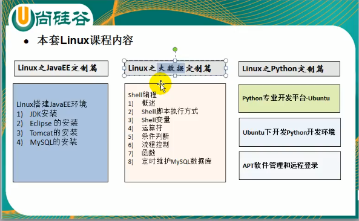

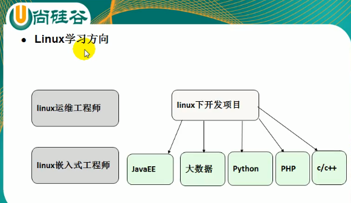

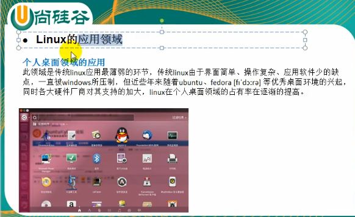

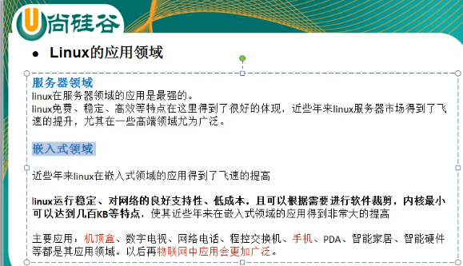


## 二.Linux基础篇

### 1.Linux介绍

1)Linux的读音网上比较多，不统一，所以不用太纠结！

​    [里纽克斯,  利尼克斯， 里纳克斯]

2）Linux是一款操作系统，免费，开源，安全，高效，稳定，处理高并发非常强悍。现在很多企业级的项目都部署到Linux上运行！

3）Linux的创始人----- 林纳斯

4）Linux吉祥物 ----- 企鹅，  Tux

5) Linux的主要发行版

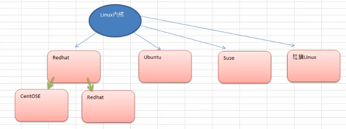

6）目前主要的操作系统

windows,linux,android

### 2.Linux和Unix关系

7）Linux和Unix的关系

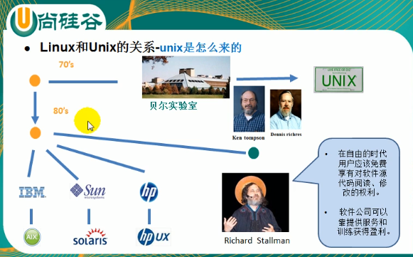


### 3.Linux和Windows比较

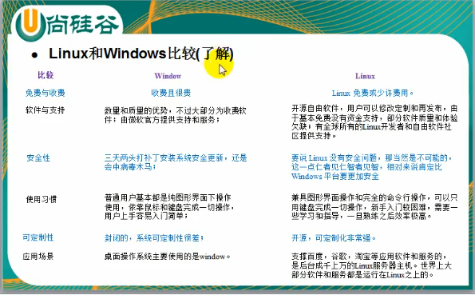

真实的工作场景模拟

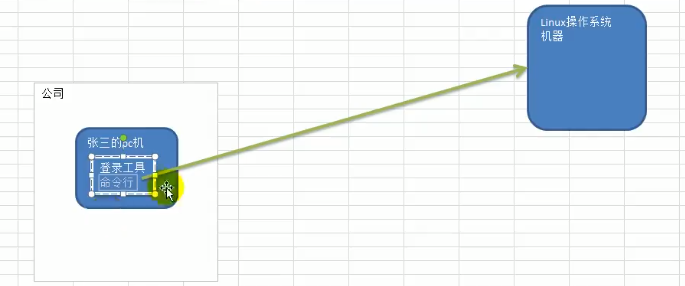

### 4.文件系统目录结构

ubuntu20.10的目录结构如下


在Linux的世界里：***一切皆文件***

```
# 各目录的功能及存放文件

opt目录： 自己安装的一些软件存放在这个目录
sbin目录： 存放超级用户的一些命令
```


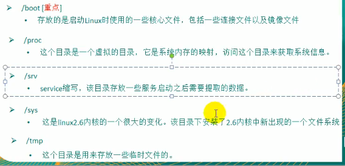


总结：

1）Linux的目录中有且只有一个根目录 /

2）LInux目录存放的内容是规划好的，不要乱动

3）Linux是以文件的形式管理我们的设备，因此在Linux中，一切皆文件!

4)Liinux各个目录下存放的内容要有个大概印象

5）学习后，你的脑海中至少要有linux树

## 三.Linux实操篇

### 1.远程登陆和远程上传下载

需要使用到的软件： Xshell,   XFtp

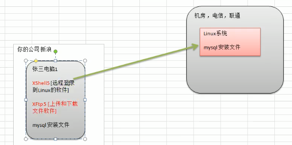

### 2.vi和vim使用


vi和vim的三种常见模式：

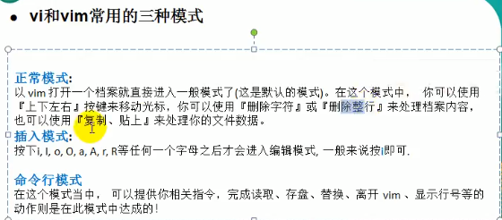


1）正常模式：打开后直接进入的就是正常模式

2)编辑模式:按下i,I,o,O,a,A,r,R等任何一个ie字母之后才会进入到编辑模式，一般都是按i的居多！

3）命令行模式:

这个模式下提供有一些命令操作，包括存盘，退出，查找等！


vim帮助文档：

在终端命令行下输入 `vimtutor`,打开帮助文档


更多快捷键请参考相关手册!!!

### 3.关机重启注销

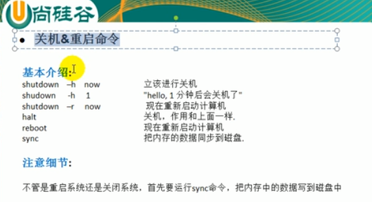

```
# 关机命令
shutdown 
	shutdown -h now     # 立即关机
	shutdown -h 1       # 表示1分钟后关机
	shutdown -r now     # 立即重启

halt
    halt    #  就是直接使用，效果等价于关机

reboot
	reboot    #  重启计算机

sync
	#  是把内存中的数据同步到磁盘中

```

注意细节：当我们关机或者重启时，都应该先执行一下`sync`指令，将数据同步到磁盘中，防止数据丢失!

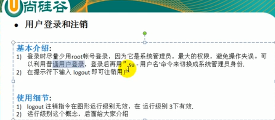

### 4.用户管理

#### 1）基本介绍

用户

用户组

家目录(/home)

每一个用户都至少从属于一个用户组，可以同时从属于多个组


说明：

​       (1)Linux是一个多用户多任务的操作系统，任何一个要使用系统资源的用户，都必须首先向管理员申请一个账      号，然后以这个账号的身份进入到系统才能操作！

​        (2)Linux的用户至少要从属于一个组

#### 2)添加用户

```
# 添加用户 
useradd 
    useradd -- help    # useradd的帮助命令

chenke@chenke-virtual-machine:~/temp$ useradd --help
用法：useradd [选项] 登录名
      useradd -D
      useradd -D [选项]

选项：
      --badnames                do not check for bad names
  -b, --base-dir BASE_DIR       新账户的主目录的基目录
      --btrfs-subvolume-home    use BTRFS subvolume for home directory
  -c, --comment COMMENT         新账户的 GECOS 字段
  -d, --home-dir HOME_DIR       新账户的主目录
  -D, --defaults                显示或更改默认的 useradd 配置
  -e, --expiredate EXPIRE_DATE  新账户的过期日期
  -f, --inactive INACTIVE       新账户的密码不活动期
  -g, --gid GROUP               新账户主组的名称或 ID
  -G, --groups GROUPS           新账户的附加组列表
  -h, --help                    显示此帮助信息并退出
  -k, --skel SKEL_DIR           使用此目录作为骨架目录
  -K, --key KEY=VALUE           不使用 /etc/login.defs 中的默认值
  -l, --no-log-init             不要将此用户添加到最近登录和登录失败数据库
  -m, --create-home             创建用户的主目录
  -M, --no-create-home          不创建用户的主目录
  -N, --no-user-group           不创建同名的组
  -o, --non-unique              允许使用重复的 UID 创建用户
  -p, --password PASSWORD       加密后的新账户密码
  -r, --system                  创建一个系统账户
  -R, --root CHROOT_DIR         chroot 到的目录
  -P, --prefix PREFIX_DIR       prefix directory where are located the /etc/* files
  -s, --shell SHELL             新账户的登录 shell
  -u, --uid UID                 新账户的用户 ID
  -U, --user-group              创建与用户同名的组
  -Z, --selinux-user SEUSER     为 SELinux 用户映射使用指定 SEUSER
      --extrausers              Use the extra users database

 # 显示默认的useradd配置
chenke@chenke-virtual-machine:~/temp$ useradd -D
GROUP=100
HOME=/home
INACTIVE=-1
EXPIRE=
SHELL=/bin/sh
SKEL=/etc/skel
CREATE_MAIL_SPOOL=no

```

细节说明：

(1)当创建用户成功后，默认会自动创建和用户同名的家目录

(2)也可以通过`useradd -d 指定目录 新的用户名`,给新创建的用户指定家目录


#### 3）删除用户

```
[chenke@1f865a20888f ~]$ userdel -h 
Usage: userdel [options] LOGIN

Options:
  -f, --force                   force some actions that would fail otherwise
                                e.g. removal of user still logged in
                                or files, even if not owned by the user
  -h, --help                    display this help message and exit
  -r, --remove                  remove home directory and mail spool
  -R, --root CHROOT_DIR         directory to chroot into
  -P, --prefix PREFIX_DIR       prefix directory where are located the /etc/* files
  -Z, --selinux-user            remove any SELinux user mapping for the user

```

(1)只删除用户，但保留用户的家目录

```
# userdel 用户名
```

（2）彻底删除用户，包括用户的家目录

```
# userdel -R 用户名
```

思考题：是否要保留家目录？

在实际工作中，一般不会将用户的家目录删除掉

#### 4)查询用户信息

```
[root@1f865a20888f home]# id --help
Usage: id [OPTION]... [USER]
Print user and group information for the specified USER,
or (when USER omitted) for the current user.

  -a             ignore, for compatibility with other versions
  -Z, --context  print only the security context of the current user
  -g, --group    print only the effective group ID
  -G, --groups   print all group IDs
  -n, --name     print a name instead of a number, for -ugG
  -r, --real     print the real ID instead of the effective ID, with -ugG
  -u, --user     print only the effective user ID
  -z, --zero     delimit entries with NUL characters, not whitespace;
                   not permitted in default format
      --help     display this help and exit
      --version  output version information and exit

Without any OPTION, print some useful set of identified information.

GNU coreutils online help: <http://www.gnu.org/software/coreutils/>
Report id translation bugs to <http://translationproject.org/team/>
For complete documentation, run: info coreutils 'id invocation'

```

例如，查询chenke的用户信息

```
[root@1f865a20888f home]# id chenke
# 用户id,组id,所在组列表
uid=1000(chenke) gid=1000(chenke) groups=1000(chenke)
```

#### 5）切换用户

```
chenke@chenke-virtual-machine:~$ su -h

用法：
 su [选项] [-] [<用户> [<参数>...]]

Change the effective user ID and group ID to that of <user>.
A mere - implies -l.  If <user> is not given, root is assumed.

选项：
 -m, -p, --preserve-environment      do not reset environment variables
 -w, --whitelist-environment <list>  don't reset specified variables

 -g, --group <组>                指定主组
 -G, --supp-group <group>        specify a supplemental group

 -, -l, --login                  使 shell 成为登录 shell
 -c, --command <命令>            使用 -c 向 shell 传递一条命令
 --session-command <命令>        使用 -c 向 shell 传递一条命令
                                   而不创建新会话
 -f, --fast                      向shell 传递 -f 选项(csh 或 tcsh)
 -s, --shell <shell>             若 /etc/shells 允许，运行<shell>
 -P, --pty                       create a new pseudo-terminal

 -h, --help                      display this help
 -V, --version                   display version

更多信息请参阅 su(1)。

```

最常用的:

```
# 切换用户
su - 用户名

# 返回到原来的用户
exit

# 查看当前我是谁
whoami
```

### 5.用户组管理

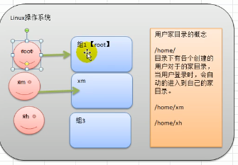


类似于角色,系统可以对有共性的多个用户进行统一的管理

#### 1）增加组

```Linux
[root@1f865a20888f home]# groupadd -h
Usage: groupadd [options] GROUP

Options:
  -f, --force                   exit successfully if the group already exists,
                                and cancel -g if the GID is already used
  -g, --gid GID                 use GID for the new group
  -h, --help                    display this help message and exit
  -K, --key KEY=VALUE           override /etc/login.defs defaults
  -o, --non-unique              allow to create groups with duplicate
                                (non-unique) GID
  -p, --password PASSWORD       use this encrypted password for the new group
  -r, --system                  create a system account
  -R, --root CHROOT_DIR         directory to chroot into
  -P, --prefix PREFIX_DIR       directory prefix

```

案例：创建用户时指定组

```Linux
[root@1f865a20888f home]# groupadd wudang
[root@1f865a20888f home]# useradd zhangwuji -g wudang
[root@1f865a20888f home]# id zhangwuji 
uid=1002(zhangwuji) gid=1002(wudang) groups=1002(wudang)

```


#### 2)删除组

```
[root@1f865a20888f home]# groupdel -h
Usage: groupdel [options] GROUP

Options:
  -h, --help                    display this help message and exit
  -R, --root CHROOT_DIR         directory to chroot into
  -P, --prefix PREFIX_DIR       prefix directory where are located the /etc/* files
  -f, --force                   delete group even if it is the primary group of a user

```

#### 3)修改用户属性

```
[root@1f865a20888f home]# usermod -h
Usage: usermod [options] LOGIN

Options:
  -c, --comment COMMENT         new value of the GECOS field
  -d, --home HOME_DIR           new home directory for the user account
  -e, --expiredate EXPIRE_DATE  set account expiration date to EXPIRE_DATE
  -f, --inactive INACTIVE       set password inactive after expiration
                                to INACTIVE
  -g, --gid GROUP               force use GROUP as new primary group
  -G, --groups GROUPS           new list of supplementary GROUPS
  -a, --append                  append the user to the supplemental GROUPS
                                mentioned by the -G option without removing
                                the user from other groups
  -h, --help                    display this help message and exit
  -l, --login NEW_LOGIN         new value of the login name
  -L, --lock                    lock the user account
  -m, --move-home               move contents of the home directory to the
                                new location (use only with -d)
  -o, --non-unique              allow using duplicate (non-unique) UID
  -p, --password PASSWORD       use encrypted password for the new password
  -R, --root CHROOT_DIR         directory to chroot into
  -P, --prefix PREFIX_DIR       prefix directory where are located the /etc/* files
  -s, --shell SHELL             new login shell for the user account
  -u, --uid UID                 new UID for the user account
  -U, --unlock                  unlock the user account
  -v, --add-subuids FIRST-LAST  add range of subordinate uids
  -V, --del-subuids FIRST-LAST  remove range of subordinate uids
  -w, --add-subgids FIRST-LAST  add range of subordinate gids
  -W, --del-subgids FIRST-LAST  remove range of subordinate gids
  -Z, --selinux-user SEUSER     new SELinux user mapping for the user account

```

案例1：修改用户所在的组

```
# 查看用户信息
[root@1f865a20888f home]# id zhangwuji
uid=1002(zhangwuji) gid=1002(wudang) groups=1002(wudang)

# 修改所在组
[root@1f865a20888f home]# usermod -g chenke  zhangwuji
[root@1f865a20888f home]# id zhangwuji
uid=1002(zhangwuji) gid=1000(chenke) groups=1000(chenke)


```

#### 4）用户和组的配置文件

用户配置文件   /etc/passwd


```
# 每一行的含义
[root@1f865a20888f home]# cat /etc/passwd
# 用户名:加密密码:用户id:组id:附加组id列表:用户家目录:登陆shell
root:x:0:0:root:/root:/bin/bash

```

组配置文件    /etc/group


```
# 每一行含义
[root@1f865a20888f home]# cat /etc/group
# 组名称：组口令：组id:有哪些用户属于该组的id列表(是隐藏的)
root:x:0:


```


口令配置文件  /etc/shadow


### 6.常用指令

#### 1）运行级别

Linux系统共有七大运行级别：


```
运行基本说明
0 : 关机
1 ：单用户[找回丢失密码]
2 ：多用户状态没有网络服务
3 ： 多用户状态有网络服务
4 ：系统未使用保留给用户
5 ： 图形界面
6 : 系统重启
常用的运行级别是3和5

运行级别的配置文件 /etc/initable
ubuntu20.04版本中未发现该配置文件
```

为什么要设计运行级别？

类似于window的安全模式，不同的级别有不同的权限

> **案例：如何找回密码**

如果我们一不小心忘记了密码，怎么找回？

思路：进入到单用户模式进行修改

在启动界面出现logo的时候，快速按下e键，进入到命令模式中


按下e键进入到命令模式


输入1进入到单用户模式


此时输入b建，将会进入到单用户模式，并且已root身份登陆


此时就可以修改root密码了


关于这个地方安全性的理解：

必须要在实体机中才可以修改，云端虚拟机是无法修改的


#### 2）帮助命令

当我们对某个指令不熟悉时，可以使用linux提供的帮助命令

##### (1) man指令

```
# 案例：查看ls的帮助文档
man ls
```


##### (2)help指令

案例：查看cd说明

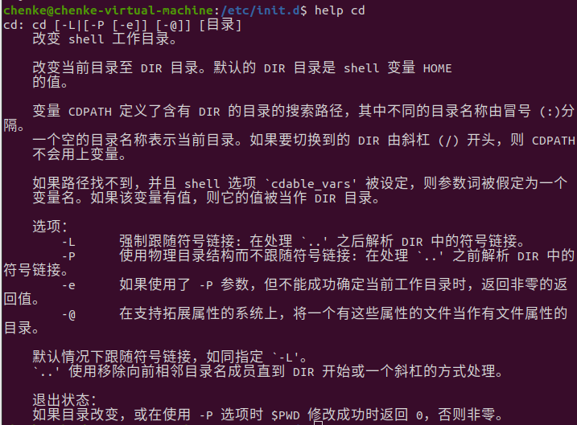


建议：**实在不行，就直接百度吧！！！**


#### 3）文件目录类

##### (1)pwd指令

功能：显示当前工作目录的绝对路径


##### (2)ls指令

功能：显示当前目录下的文件和子目录

```
# 标准用法
ls 目录
ls -a  目录      # 显示隐藏文件和目录
ls -al 目录      # 并且显示详细信息
```


##### (3)cd 指令

功能：切换目录


绝对路径：从/目录开始定位

相对目录：从当前位置开始定位


cd -   直接到之前的目录

cd ~    直接到家目录

cd ..     返回上级目录

##### (4)mkdir指令

功能：创建目录

```
chenke@chenke-virtual-machine:/$ mkdir --help
用法：mkdir [选项]... 目录...
Create the DIRECTORY(ies), if they do not already exist.

必选参数对长短选项同时适用。
  -m, --mode=MODE   set file mode (as in chmod), not a=rwx - umask
  -p, --parents     no error if existing, make parent directories as needed
  -v, --verbose     print a message for each created directory
  -Z                   set SELinux security context of each created directory
                         to the default type
      --context[=CTX]  like -Z, or if CTX is specified then set the SELinux
                         or SMACK security context to CTX
      --help		显示此帮助信息并退出
      --version		显示版本信息并退出

GNU coreutils 在线帮助：<https://www.gnu.org/software/coreutils/>
请向 <http://translationproject.org/team/zh_CN.html> 报告 mkdir 的翻译错误
完整文档请见：<https://www.gnu.org/software/coreutils/mkdir>
或者在本地使用：info '(coreutils) mkdir invocation'

```


创建多级目录

```
mkdir -p /home/chenke/mytest/test1
```

##### (5)rmdir指令

功能：删除空目录

如果该目录不是空目录，会报错！

可以使用 rm -rf 来删除

##### (6)touch指令

功能：创建文件

```
# 创建mytest文件
touch mytest
```

##### (7) rm指令

功能：删除文件或目录

```
rm aaa.txt
rm -rf bbb
```

##### (8)mv指令

功能：移动文件与重命名

```
chenke@chenke-virtual-machine:~/test$ mv --help
用法：mv [选项]... [-T] 源文件 目标文件
　或：mv [选项]... 源文件... 目录
　或：mv [选项]... -t 目录 源文件...
Rename SOURCE to DEST, or move SOURCE(s) to DIRECTORY.

必选参数对长短选项同时适用。
      --backup[=CONTROL]       为每个已存在的目标文件创建备份
  -b                           类似--backup 但不接受参数
  -f, --force                  覆盖前不询问
  -i, --interactive            覆盖前询问
  -n, --no-clobber             不覆盖已存在文件
如果您指定了-i、-f、-n 中的多个，仅最后一个生效。
      --strip-trailing-slashes	去掉每个源文件参数尾部的斜线
  -S, --suffix=SUFFIX		替换常用的备份文件后缀
  -t, --target-directory=DIRECTORY  move all SOURCE arguments into DIRECTORY
  -T, --no-target-directory    treat DEST as a normal file
  -u, --update                 move only when the SOURCE file is newer
                                 than the destination file or when the
                                 destination file is missing
  -v, --verbose                explain what is being done
  -Z, --context                set SELinux security context of destination
                                 file to default type
      --help		显示此帮助信息并退出
      --version		显示版本信息并退出

The backup suffix is '~', unless set with --suffix or SIMPLE_BACKUP_SUFFIX.
The version control method may be selected via the --backup option or through
the VERSION_CONTROL environment variable.  Here are the values:

  none, off       不进行备份(即使使用了--backup 选项)
  numbered, t     备份文件加上数字进行排序
  existing, nil   若有数字的备份文件已经存在则使用数字，否则使用普通方式备份
  simple, never   永远使用普通方式备份

GNU coreutils 在线帮助：<https://www.gnu.org/software/coreutils/>
请向 <http://translationproject.org/team/zh_CN.html> 报告 mv 的翻译错误
完整文档请见：<https://www.gnu.org/software/coreutils/mv>
或者在本地使用：info '(coreutils) mv invocation'

```

该指令有两个作用：剪切与重命名

1.如果是在同一个目录下执行的操作，系统认为是重命名操作

2.如果在不同目录下

（1）如果目标文件不存在，系统认为是移动并且重命名操作

（2）如果目标目录存在，系统认为是移动操作

##### (9)cat指令

功能：直接查看文件内容

只可以查看，不可以修改

```
chenke@chenke-virtual-machine:~/test$ cat --help
用法：cat [选项]... [文件]...
连接所有指定文件并将结果写到标准输出。

如果没有指定文件，或者文件为"-"，则从标准输入读取。

  -A, --show-all           equivalent to -vET
  -b, --number-nonblank    number nonempty output lines, overrides -n
  -e                       equivalent to -vE
  -E, --show-ends          display $ at end of each line
  -n, --number             number all output lines
  -s, --squeeze-blank      suppress repeated empty output lines
  -t                       与-vT 等价
  -T, --show-tabs          将跳格字符显示为^I
  -u                       (被忽略)
  -v, --show-nonprinting   使用^ 和M- 引用，除了LFD和 TAB 之外
      --help		显示此帮助信息并退出
      --version		显示版本信息并退出

示例：
  cat f - g  先输出f 的内容，然后输出标准输入的内容，最后输出g 的内容。
  cat        将标准输入的内容复制到标准输出。

GNU coreutils 在线帮助：<https://www.gnu.org/software/coreutils/>
请向 <http://translationproject.org/team/zh_CN.html> 报告 cat 的翻译错误
完整文档请见：<https://www.gnu.org/software/coreutils/cat>
或者在本地使用：info '(coreutils) cat invocation'

```

cat指令通常和more指令结合使用

```
cat /home/mytest/docker1 | more
```


##### (10)more指令

more指令是一个基于vi的文本过滤器，它以全屏的方式按页显示文本文件的内容。

```
chenke@chenke-virtual-machine:~/test$ more --help

用法：
 more [选项] <文件>...

适合屏幕查看的文件阅读输出工具。

选项：
 -d          显示帮助而非响铃
 -f          计算逻辑行数，而非屏幕行数
 -l          屏蔽换页(form feed)后的暂停
 -c          不滚动，显示文本并清理行末
 -p          不滚动，清除屏幕并显示文本
 -s          将多行空行压缩为一行
 -u          屏蔽下划线
 -<数字>     每屏的行数
 +<数字>     从指定行开始显示文件
 +/<字符串>  从匹配搜索字符串的位置开始显示文件

     --help     display this help
 -V, --version  display version

更多信息请参阅 more(1)。

```


more指令不支持后退

##### (11)less指令


快捷键操作

enter   向下显示一行

space  向下显示一屏

具体操作手册可以使用 `less --help`指令查看

较大的文件查看推荐使用`less`指令


##### (12)输出重定向和追加


`>`  输出重定向会覆盖原文件

`>>`   追加不会覆盖原文件

##### (13) echo 指令

功能：输出内容到控制台


##### (14)head指令

功能：用于显示文件的开头部分，默认显示前10行

```
chenke@chenke-virtual-machine:~$ head --help
用法：head [选项]... [文件]...
Print the first 10 lines of each FILE to standard output.
With more than one FILE, precede each with a header giving the file name.

如果没有指定文件，或者文件为"-"，则从标准输入读取。

必选参数对长短选项同时适用。
  -c, --bytes=[-]NUM       print the first NUM bytes of each file;
                             with the leading '-', print all but the last
                             NUM bytes of each file
  -n, --lines=[-]NUM       print the first NUM lines instead of the first 10;
                             with the leading '-', print all but the last
                             NUM lines of each file
  -q, --quiet, --silent	不显示包含给定文件名的文件头
  -v, --verbose		总是显示包含给定文件名的文件头
  -z, --zero-terminated    以 NUL 字符而非换行符作为行尾分隔符
      --help		显示此帮助信息并退出
      --version		显示版本信息并退出

NUM may have a multiplier suffix:
b 512, kB 1000, K 1024, MB 1000*1000, M 1024*1024,
GB 1000*1000*1000, G 1024*1024*1024, and so on for T, P, E, Z, Y.

GNU coreutils 在线帮助：<https://www.gnu.org/software/coreutils/>
请向 <http://translationproject.org/team/zh_CN.html> 报告 head 的翻译错误
完整文档请见：<https://www.gnu.org/software/coreutils/head>
或者在本地使用：info '(coreutils) head invocation'

```


##### (15)tail指令

功能：显示文件的尾部内容，默认显示最后10行

```
chenke@chenke-virtual-machine:~/test$ tail --help
用法：tail [选项]... [文件]...
Print the last 10 lines of each FILE to standard output.
With more than one FILE, precede each with a header giving the file name.

如果没有指定文件，或者文件为"-"，则从标准输入读取。

必选参数对长短选项同时适用。
  -c, --bytes=[+]NUM       output the last NUM bytes; or use -c +NUM to
                             output starting with byte NUM of each file
  -f, --follow[={name|descriptor}]
                           output appended data as the file grows;
                             an absent option argument means 'descriptor'
  -F                       same as --follow=name --retry
  -n, --lines=[+]NUM       output the last NUM lines, instead of the last 10;
                             or use -n +NUM to output starting with line NUM
      --max-unchanged-stats=N
                           with --follow=name, reopen a FILE which has not
                             changed size after N (default 5) iterations
                             to see if it has been unlinked or renamed
                             (this is the usual case of rotated log files);
                             with inotify, this option is rarely useful
      --pid=PID            with -f, terminate after process ID, PID dies
  -q, --quiet, --silent    never output headers giving file names
      --retry              keep trying to open a file if it is inaccessible
  -s, --sleep-interval=N   with -f, sleep for approximately N seconds
                             (default 1.0) between iterations;
                             with inotify and --pid=P, check process P at
                             least once every N seconds
  -v, --verbose            always output headers giving file names
  -z, --zero-terminated    以 NUL 字符而非换行符作为行尾分隔符
      --help		显示此帮助信息并退出
      --version		显示版本信息并退出

NUM may have a multiplier suffix:
b 512, kB 1000, K 1024, MB 1000*1000, M 1024*1024,
GB 1000*1000*1000, G 1024*1024*1024, and so on for T, P, E, Z, Y.

如果您希望即时追查一个文件的有效名称而非描述内容(例如循环日志)，默认
的程序动作并不如您所愿。在这种场合可以使用--follow=name 选项，它会使
tail 定期追踪打开给定名称的文件，以确认它是否被删除或被其它某些程序重新创建过。


```


案例：实时监控日志文件

```
tail -f mylog
```

##### (16)ln指令

功能：软链接也叫符号链接,类似于window中的快捷方式，主要存放了链接其他文件的路径。

```
chenke@chenke-virtual-machine:~/test$ ln --help
Usage: ln [OPTION]... [-T] TARGET LINK_NAME
  or:  ln [OPTION]... TARGET
  or:  ln [OPTION]... TARGET... DIRECTORY
  or:  ln [OPTION]... -t DIRECTORY TARGET...
In the 1st form, create a link to TARGET with the name LINK_NAME.
In the 2nd form, create a link to TARGET in the current directory.
In the 3rd and 4th forms, create links to each TARGET in DIRECTORY.
Create hard links by default, symbolic links with --symbolic.
By default, each destination (name of new link) should not already exist.
When creating hard links, each TARGET must exist.  Symbolic links
can hold arbitrary text; if later resolved, a relative link is
interpreted in relation to its parent directory.

必选参数对长短选项同时适用。
      --backup[=CONTROL]	为每个已存在的目标文件创建备份文件
  -b				类似--backup，但不接受任何参数
  -d, -F, --directory		创建指向目录的硬链接(只适用于超级用户)
  -f, --force			强行删除任何已存在的目标文件
  -i, --interactive           prompt whether to remove destinations
  -L, --logical               dereference TARGETs that are symbolic links
  -n, --no-dereference        treat LINK_NAME as a normal file if
                                it is a symbolic link to a directory
  -P, --physical              make hard links directly to symbolic links
  -r, --relative              create symbolic links relative to link location
  -s, --symbolic              make symbolic links instead of hard links
  -S, --suffix=SUFFIX         override the usual backup suffix
  -t, --target-directory=DIRECTORY  specify the DIRECTORY in which to create
                                the links
  -T, --no-target-directory   treat LINK_NAME as a normal file always
  -v, --verbose               print name of each linked file
      --help		显示此帮助信息并退出
      --version		显示版本信息并退出

The backup suffix is '~', unless set with --suffix or SIMPLE_BACKUP_SUFFIX.
The version control method may be selected via the --backup option or through
the VERSION_CONTROL environment variable.  Here are the values:

  none, off       不进行备份(即使使用了--backup 选项)
  numbered, t     备份文件加上数字进行排序
  existing, nil   若有数字的备份文件已经存在则使用数字，否则使用普通方式备份
  simple, never   永远使用普通方式备份

Using -s ignores -L and -P.  Otherwise, the last option specified controls
behavior when a TARGET is a symbolic link, defaulting to -P.

```

案例：创建文件的软链接

```
# 该案例是建立了mytest的软链接到/home/chenke/mytest2
ln -s /home/chenke/mytest /home/chenke/mytest2
```

##### (17)history指令

功能：可以查看历史指令记录

```
chenke@chenke-virtual-machine:~/test$ history --help
history: history [-c] [-d 偏移量] [n] 或 history -anrw [文件名] 或 history -ps 参数 [参数...]
    显示或操纵历史列表。
    
    带行号显示历史列表，将每个被修改的条目加上 `*' 前缀。
    参数 N 会仅列出最后的 N 个条目。
    
    选项：
      -c	删除所有条目从而清空历史列表。
      -d 偏移量	从指定位置删除历史列表。负偏移量将从历史条目末尾
    		开始计数
    
      -a	将当前会话的历史行追加到历史文件中
      -n	从历史文件中读取所有未被读取的行
    		并且将它们附加到历史列表
      -r	读取历史文件并将内容追加到历史列表中
      -w	将当前历史写入到历史文件中
    
      -p	对每一个 ARG 参数展开历史并显示结果，而不存储到历史列表中
      -s	以单条记录追加 ARG 到历史列表中
    
    如果给定了 FILENAME 文件名，则它将被作为历史文件。否则
    如果 $HISTFILE 变量有值的话使用之，不然使用 ~/.bash_history 文件。
    
    如果 $HISTTIMEFORMAT 变量被设定并且不为空，它的值会被用于
    strftime(3) 的格式字符串来打印与每一个显示的历史条目想关联的
    时间戳，否则不打印时间戳。
    
    退出状态：
    返回成功，除非使用了无效的选项或者发生错误。

```

案例：根据历史记录来执行命令

```
!历史编号
```


#### 4）时间日期类


##### (1)date指令

```

chenke@chenke-virtual-machine:~/test$ date --help
用法：date [选项]... [+格式]
　或：date [-u|--utc|--universal] [MMDDhhmm[[CC]YY][.ss]]
Display the current time in the given FORMAT, or set the system date.

必选参数对长短选项同时适用。
  -d, --date=STRING          display time described by STRING, not 'now'
      --debug                annotate the parsed date,
                              and warn about questionable usage to stderr
  -f, --file=DATEFILE        like --date; once for each line of DATEFILE
  -I[FMT], --iso-8601[=FMT]  output date/time in ISO 8601 format.
                               FMT='date' for date only (the default),
                               'hours', 'minutes', 'seconds', or 'ns'
                               for date and time to the indicated precision.
                               Example: 2006-08-14T02:34:56-06:00
  -R, --rfc-email            output date and time in RFC 5322 format.
                               Example: Mon, 14 Aug 2006 02:34:56 -0600
      --rfc-3339=FMT         output date/time in RFC 3339 format.
                               FMT='date', 'seconds', or 'ns'
                               for date and time to the indicated precision.
                               Example: 2006-08-14 02:34:56-06:00
  -r, --reference=FILE       display the last modification time of FILE
  -s, --set=STRING           set time described by STRING
  -u, --utc, --universal     print or set Coordinated Universal Time (UTC)
      --help		显示此帮助信息并退出
      --version		显示版本信息并退出

给定的格式FORMAT 控制着输出，解释序列如下：

  %%	一个文字的 %
  %a	当前locale 的星期名缩写(例如： 日，代表星期日)
  %A	当前locale 的星期名全称 (如：星期日)
  %b	当前locale 的月名缩写 (如：一，代表一月)
  %B	当前locale 的月名全称 (如：一月)
  %c	当前locale 的日期和时间 (如：2005年3月3日 星期四 23:05:25)
  %C	世纪；比如 %Y，通常为省略当前年份的后两位数字(例如：20)
  %d	按月计的日期(例如：01)
  %D	按月计的日期；等于%m/%d/%y
  %e	按月计的日期，添加空格，等于%_d
  %F	完整日期格式，等价于 %Y-%m-%d
  %g	ISO-8601 格式年份的最后两位 (参见%G)
  %G	ISO-8601 格式年份 (参见%V)，一般只和 %V 结合使用
  %h	等于%b
  %H	小时(00-23)
  %I	小时(00-12)
  %j	按年计的日期(001-366)
  %k   hour, space padded ( 0..23); same as %_H
  %l   hour, space padded ( 1..12); same as %_I
  %m   month (01..12)
  %M   minute (00..59)
  %n   a newline
  %N   nanoseconds (000000000..999999999)
  %p   locale's equivalent of either AM or PM; blank if not known
  %P   like %p, but lower case
  %q   quarter of year (1..4)
  %r   locale's 12-hour clock time (e.g., 11:11:04 PM)
  %R   24-hour hour and minute; same as %H:%M
  %s   seconds since 1970-01-01 00:00:00 UTC
  %S	秒(00-60)
  %t	输出制表符 Tab
  %T	时间，等于%H:%M:%S
  %u	星期，1 代表星期一
  %U	一年中的第几周，以周日为每星期第一天(00-53)
  %V	ISO-8601 格式规范下的一年中第几周，以周一为每星期第一天(01-53)
  %w	一星期中的第几日(0-6)，0 代表周一
  %W	一年中的第几周，以周一为每星期第一天(00-53)
  %x	当前locale 下的日期描述 (如：12/31/99)
  %X	当前locale 下的时间描述 (如：23:13:48)
  %y	年份最后两位数位 (00-99)
  %Y	年份
  %z +hhmm		数字时区(例如，-0400)
  %:z +hh:mm		数字时区(例如，-04:00)
  %::z +hh:mm:ss	数字时区(例如，-04:00:00)
  %:::z			数字时区带有必要的精度 (例如，-04，+05:30)
  %Z			按字母表排序的时区缩写 (例如，EDT)

默认情况下，日期的数字区域以0 填充。
The following optional flags may follow '%':

  -  (hyphen) do not pad the field
  _  (underscore) pad with spaces
  0  (zero) pad with zeros
  ^  use upper case if possible
  #  use opposite case if possible

在任何标记之后还允许一个可选的域宽度指定，它是一个十进制数字。
作为一个可选的修饰声明，它可以是E，在可能的情况下使用本地环境关联的
表示方式；或者是O，在可能的情况下使用本地环境关联的数字符号。

Examples:
Convert seconds since the epoch (1970-01-01 UTC) to a date
  $ date --date='@2147483647'

Show the time on the west coast of the US (use tzselect(1) to find TZ)
  $ TZ='America/Los_Angeles' date

Show the local time for 9AM next Friday on the west coast of the US
  $ date --date='TZ="America/Los_Angeles" 09:00 next Fri'

```


案例：设置日期

```
date -s "2020-08-02 00:00:00"
```

##### (2)cal指令

功能：查看日历

```
chenke@chenke-virtual-machine:~/test$ cal -h
Usage: cal [general options] [-jy] [[month] year]
       cal [general options] [-j] [-m month] [year]
       ncal -C [general options] [-jy] [[month] year]
       ncal -C [general options] [-j] [-m month] [year]
       ncal [general options] [-bhJjpwySM] [-H yyyy-mm-dd] [-s country_code] [[month] year]
       ncal [general options] [-bhJeoSM] [year]
General options: [-31] [-A months] [-B months] [-d yyyy-mm]

```

案例1：显示当前月日历


案例2：查看指定年份日历


#### 5)搜索查找类

##### (1)find指令

功能：将从指定目录向下递归遍历其各个子目录，将满足条件的文件或者目录显示在终端

```
chenke@chenke-virtual-machine:~/test$ find --help
Usage: find [-H] [-L] [-P] [-Olevel] [-D debugopts] [path...] [expression]

默认路径为当前目录；默认表达式为 -print
表达式可能由下列成份组成：操作符、选项、测试表达式以及动作：
操作符 (优先级递减；未做任何指定时默认使用 -and):
      ( EXPR )   ! EXPR   -not EXPR   EXPR1 -a EXPR2   EXPR1 -and EXPR2
      EXPR1 -o EXPR2   EXPR1 -or EXPR2   EXPR1 , EXPR2
位置选项 (总是真): -daystart -follow -regextype

普通选项 (总是真，在其它表达式前指定):
      -depth --help -maxdepth LEVELS -mindepth LEVELS -mount -noleaf
      --version -xdev -ignore_readdir_race -noignore_readdir_race
测试(N可以是 +N 或-N 或 N):-amin N -anewer FILE -atime N -cmin  
      -cnewer 文件 -ctime N -empty -false -fstype 类型 -gid N -group 名称
      -ilname 匹配模式 -iname 匹配模式 -inum N -ipath 匹配模式 -iregex 匹配模式
      -links N -lname 匹配模式 -mmin N -mtime N -name 匹配模式 -newer 文件
      -nouser -nogroup -path PATTERN -perm [-/]MODE -regex PATTERN
      -readable -writable -executable
      -wholename PATTERN -size N[bcwkMG] -true -type [bcdpflsD] -uid N
      -used N -user NAME -xtype [bcdpfls]      -context 文本

actions: -delete -print0 -printf FORMAT -fprintf FILE FORMAT -print 
      -fprint0 FILE -fprint FILE -ls -fls FILE -prune -quit
      -exec COMMAND ; -exec COMMAND {} + -ok COMMAND ;
      -execdir COMMAND ; -execdir COMMAND {} + -okdir COMMAND ;

Valid arguments for -D:
exec, opt, rates, search, stat, time, tree, all, help
Use '-D help' for a description of the options, or see find(1)


```

基本语法：

```
find [搜索范围]  [选项]

# 最常用的三个选项：
-name<查询方式>     # 按照指定的文件名查找文件
-user<用户名>       # 查找指定用户的所有文件
-size<文件大小>     # 根据文件大小查找
```

案例1：根据文件名查找文件


案例2：根据用户名查找


案例3：查找Linux下文件大于10M的文件

+20M  表示大于20M的

20M  表示等于20M的

-20M 表示小于20M的

也可以使用通配符  *.txt


##### (2)locate指令

##### (3)grep指令

功能：可以过滤查找

##### (4)管道命令

通常和其他指令结合使用

```
chenke@chenke-virtual-machine:~$ grep --help
用法: grep [选项]... 模式 [文件]...
在每个<文件>中查找给定<模式>。
例如：grep -i 'hello world' menu.h main.c
<模式>可以包括多个模式字符串，使用换行符进行分隔。

模式选择与解释：
  -E, --extended-regexp     <模式> 是扩展正则表达式
  -F, --fixed-strings       <模式> 是字符串
  -G, --basic-regexp        <模式> 是基本正则表达式
  -P, --perl-regexp         <模式> 是 Perl 正则表达式
  -e, --regexp=<模式>       用指定的<模式>字符串来进行匹配操作
  -f, --file=<文件>         从给定<文件>中取得<模式>
  -i, --ignore-case         在模式和数据中忽略大小写
      --no-ignore-case      不要忽略大小写（默认）
  -w, --word-regexp         强制<模式>仅完全匹配字词
  -x, --line-regexp         强制<模式>仅完全匹配整行
  -z, --null-data           数据行以一个 0 字节结束，而非换行符

杂项:
  -s, --no-messages         不显示错误信息
  -v, --invert-match        选中不匹配的行
  -V, --version             显示版本信息并退出
      --help                显示此帮助并退出

输出控制：
  -m, --max-count=<次数>    得到给定<次数>次匹配后停止
  -b, --byte-offset         输出的同时打印字节偏移
  -n, --line-number         输出的同时打印行号
      --line-buffered       每行输出后刷新输出缓冲区
  -H, --with-filename       为输出行打印文件名
  -h, --no-filename         输出时不显示文件名前缀
      --label=<标签>        将给定<标签>作为标准输入文件名前缀
  -o, --only-matching       只显示行中非空匹配部分
  -q, --quiet, --silent     不显示所有常规输出
      --binary-files=TYPE   设定二进制文件的 TYPE（类型）；
                            TYPE 可以是 'binary'、'text' 或 'without-match'
  -a, --text                等同于 --binary-files=text
  -I                        等同于 --binary-files=without-match
  -d, --directories=ACTION  读取目录的方式；
                            ACTION 可以是`read', `recurse',或`skip'
  -D, --devices=ACTION      读取设备、先入先出队列、套接字的方式；
                            ACTION 可以是`read'或`skip'
  -r, --recursive           等同于--directories=recurse
  -R, --dereference-recursive       同上，但遍历所有符号链接
      --include=GLOB        search only files that match GLOB (a file pattern)
      --exclude=GLOB        skip files that match GLOB
      --exclude-from=FILE   skip files that match any file pattern from FILE
      --exclude-dir=GLOB    skip directories that match GLOB
  -L, --files-without-match  只打印没有匹配上的<文件>的名称
  -l, --files-with-matches  只打印有匹配的<文件>的名称
  -c, --count               只打印每个<文件>中的匹配行数目
  -T, --initial-tab         行首制表符对齐（如有必要）
  -Z, --null                在<文件>名最后打印空字符

文件控制:
  -B, --before-context=NUM  打印文本及其前面NUM 行
  -A, --after-context=NUM   打印文本及其后面NUM 行
  -C, --context=NUM         打印NUM 行输出文本
  -NUM                      等同于 --context=NUM
      --color[=WHEN],
      --colour[=WHEN]       使用标记高亮匹配字串；
                            WHEN 可以是“always”、“never”或“auto”
  -U, --binary              不要清除行尾的 CR 字符（MSDOS/Windows）

若给定<文件>为“-”，则从读取标准输入。  若无<文件>参数，则除非处于
递归工作模式视为从“.”读取之外，一律视为从“-”读取。如果提供了少于
两个<文件>参数，则默认启用 -h 选项。如果有任意行（或者指定了 -L 选项
并有任意文件）被匹配，则退出状态为 0，否则为 1；如果有错误产生，且未指
定 -q 参数，则退出状态为 2。

```


#### 6)压缩和解压缩类

##### (1)gzip和gunzip指令

* gzip用于压缩文件
* gunzip用于解压缩文件

gzip命令的英文是“GNUzip”，是常用来压缩文件的工具，gzip是个使用广泛的压缩程序，文件经它压缩过后，其名称后面会多处“.gz”扩展名。

gzip是在Linux系统中经常使用的一个对文件进行压缩和解压缩的命令，既方便又好用。gzip不仅可以用来压缩大的、较少使用的文件以节省磁盘空间，还可以和tar命令一起构成Linux操作系统中比较流行的压缩文件格式。据统计，gzip命令对文本文件有60%～70%的压缩率。减少文件大小有两个明显的好处，一是可以减少存储空间，二是通过网络传输文件时，可以减少传输的时间。

**语法格式：**gzip [参数]

**常用参数：**

| -a   | 使用ASCII文字模式                                  |
| ---- | -------------------------------------------------- |
| -d   | 解开压缩文件                                       |
| -f   | 强行压缩文件                                       |
| -l   | 列出压缩文件的相关信息                             |
| -c   | 把压缩后的文件输出到标准输出设备，不去更动原始文件 |
| -r   | 递归处理，将指定目录下的所有文件及子目录一并处理   |
| -q   | 不显示警告信息                                     |

案例：压缩mylog.txt文件

```
# 压缩mylog.txt文件

gzip mylog      # 将会在同目录下生成mylog.gz的压缩文件，但是原来的文件将不会被保留
```


gunzip命令用于解压文件，它是个使用广泛的解压缩程序，它用于解开被gzip压缩过的文件，这些压缩文件预设最后的扩展名为”.gz”。事实上gunzip就是gzip的硬连接，因此不论是压缩或解压缩，都可通过gzip命令单独完成。

**语法格式：**gunzip [参数]

**常用参数：**

| -a或--ascii                                  | 使用ASCII文字模式                                            |
| -------------------------------------------- | ------------------------------------------------------------ |
| -c或--stdout或--to-stdout                    | 把解压后的文件输出到标准输出设备                             |
| -f或-force                                   | 强行解开压缩文件，不理会文件名称或硬连接是否存在以及该文件是否为符号连接 |
| -h或--help                                   | 在线帮助。                                                   |
| -l或--list                                   | 列出压缩文件的相关信息                                       |
| -L或--license                                | 显示版本与版权信息                                           |
| -n或--no-name                                | 解压缩时，若压缩文件内含有远来的文件名称及时间戳记，则将其忽略不予处理 |
| -N或--name                                   | 解压缩时，若压缩文件内含有原来的文件名称及时间戳记，则将其回存到解开的文件上 |
| -q或--quiet                                  | 不显示警告信息                                               |
| -r或--recursive                              | 递归处理，将指定目录下的所有文件及子目录一并处理             |
| -S<压缩字尾字符串>或--suffix<压缩字尾字符串> | 更改压缩字尾字符串                                           |
| -t或--test                                   | 测试压缩文件是否正确无误                                     |
| -v或--verbose                                | 显示指令执行过程                                             |
| -V或--version                                | 显示版本信息                                                 |

案例：解压缩文件mylog.gz

```
# 解压缩文件mylog.gz,此时mylog.gz将会被删除，还原成原来的mylog.txt

gunzip mylog.gz
```


##### (2)zip和unzip指令

* **zip指令用于压缩**

zip程序将一个或多个压缩文件与有关文件的信息(名称、路径、日期、上次修改的时间、保护和检查信息以验证文件完整性)一起放入一个压缩存档中。可以使用一个命令将整个目录结构打包到zip存档中。

对于文本文件来说，压缩比为2：1和3：1是常见的。zip只有一种压缩方法(通缩)，并且可以在不压缩的情况下存储文件。(如果添加了bzip 2支持，zip也可以使用bzip 2压缩，但这些条目需要一个合理的现代解压缩来解压缩。当选择bzip 2压缩时，它将通货紧缩替换为默认方法。)zip会自动为每个要压缩的文件选择更好的两个文件(通缩或存储，如果选择bzip2，则选择bzip2或Store)。

**语法格式：**zip [参数] [文件]

**常用参数：**

| -q             | 不显示指令执行过程                               |
| -------------- | ------------------------------------------------ |
| -r             | 递归处理，将指定目录下的所有文件和子目录一并处理 |
| -z             | 替压缩文件加上注释                               |
| -v             | 显示指令执行过程或显示版本信息                   |
| -n<字尾字符串> | 不压缩具有特定字尾字符串的文件                   |

案例：将当前目录下的所有文件及目录一并压缩成myfile1.zip

```
zip -r myfile1.zip ./
```


* **unzip指令用于解压缩**

unzip命令是用于.zip格式文件的解压缩工具 ，unzip命令将列出、测试或从zip格式存档中提取文件，这些文件通常位于MS-DOS系统上。

默认行为（就是没有选项）是从指定的ZIP存档中提取所有的文件到当前目录（及其下面的子目录）。一个配套程序zip（1L）创建ZIP存档；这两个程序都与PKWARE的PKZIP和PKUNZIP为MS-DOS创建的存档文件兼容，但许多情况下，程序选项或默认行为是不同的。

**语法格式：**unzip [参数] [文件]

```
chenke@chenke-virtual-machine:~/test$ unzip -h
UnZip 6.00 of 20 April 2009, by Debian. Original by Info-ZIP.

Usage: unzip [-Z] [-opts[modifiers]] file[.zip] [list] [-x xlist] [-d exdir]
  Default action is to extract files in list, except those in xlist, to exdir;
  file[.zip] may be a wildcard.  -Z => ZipInfo mode ("unzip -Z" for usage).

  -p  extract files to pipe, no messages     -l  list files (short format)
  -f  freshen existing files, create none    -t  test compressed archive data
  -u  update files, create if necessary      -z  display archive comment only
  -v  list verbosely/show version info       -T  timestamp archive to latest
  -x  exclude files that follow (in xlist)   -d  extract files into exdir
modifiers:
  -n  never overwrite existing files         -q  quiet mode (-qq => quieter)
  -o  overwrite files WITHOUT prompting      -a  auto-convert any text files
  -j  junk paths (do not make directories)   -aa treat ALL files as text
  -U  use escapes for all non-ASCII Unicode  -UU ignore any Unicode fields
  -C  match filenames case-insensitively     -L  make (some) names lowercase
  -X  restore UID/GID info                   -V  retain VMS version numbers
  -K  keep setuid/setgid/tacky permissions   -M  pipe through "more" pager
  -O CHARSET  specify a character encoding for DOS, Windows and OS/2 archives
  -I CHARSET  specify a character encoding for UNIX and other archives

See "unzip -hh" or unzip.txt for more help.  Examples:
  unzip data1 -x joe   => extract all files except joe from zipfile data1.zip
  unzip -p foo | more  => send contents of foo.zip via pipe into program more
  unzip -fo foo ReadMe => quietly replace existing ReadMe if archive file newer

```

案例1:查看压缩文件包中的内容，使用-l参数


案例2：将压缩文件解压到指定目录，使用-d指令

```
unzip -d ./mysql myfile1.zip
```


