# 韩顺平老师Linux视频教程

## 一.前言

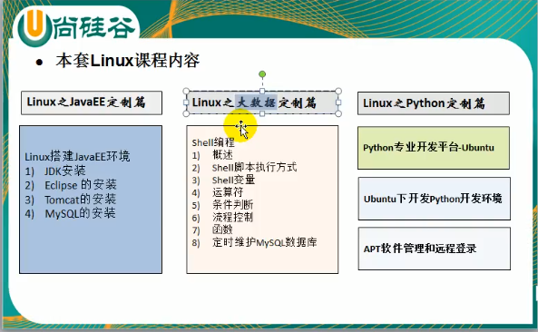

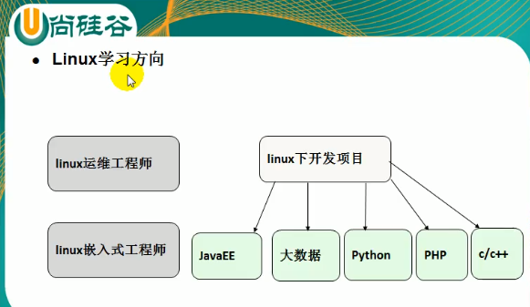

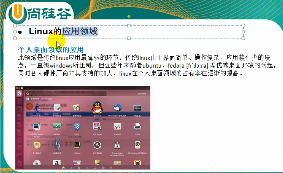

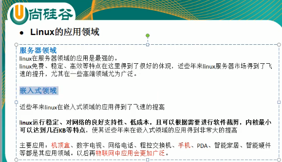

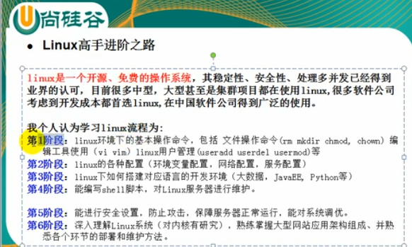

## 二.Linux基础篇

### 1.Linux介绍

1)Linux的读音网上比较多，不统一，所以不用太纠结！

​    [里纽克斯,  利尼克斯， 里纳克斯]

2）Linux是一款操作系统，免费，开源，安全，高效，稳定，处理高并发非常强悍。现在很多企业级的项目都部署到Linux上运行！

3）Linux的创始人----- 林纳斯

4）Linux吉祥物 ----- 企鹅，  Tux

5) Linux的主要发行版

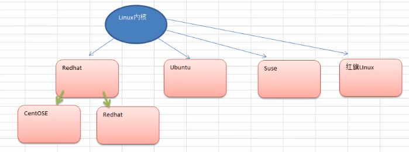

6）目前主要的操作系统

windows,linux,android

### 2.Linux和Unix关系

7）Linux和Unix的关系

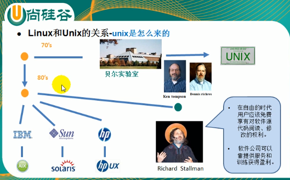

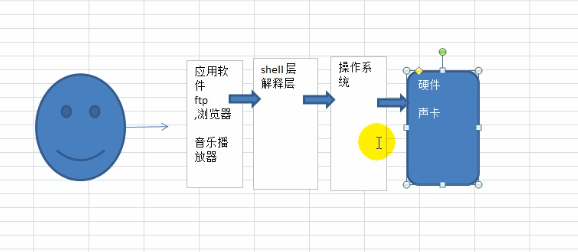

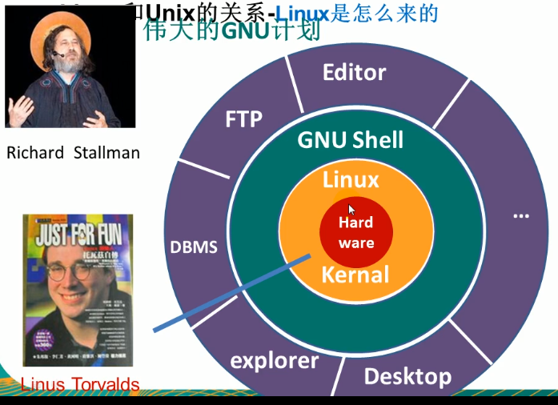

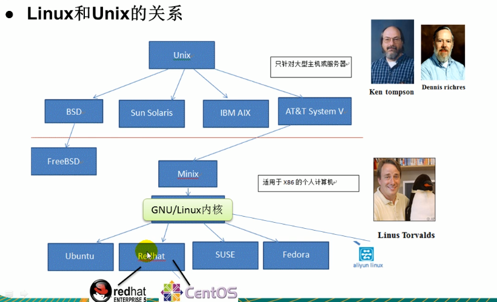

### 3.Linux和Windows比较

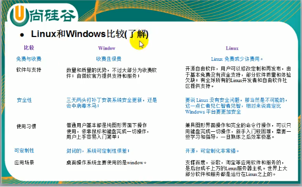

真实的工作场景模拟

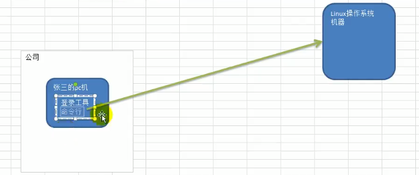

### 4.文件系统目录结构

ubuntu20.10的目录结构如下

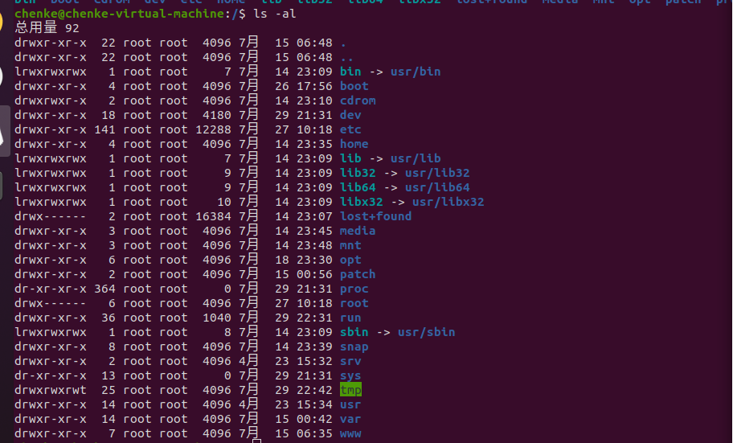

在Linux的世界里：***一切皆文件***

```
# 各目录的功能及存放文件

opt目录： 自己安装的一些软件存放在这个目录
sbin目录： 存放超级用户的一些命令
```

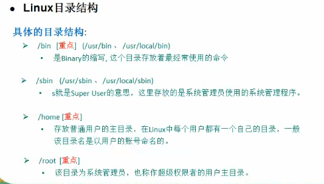

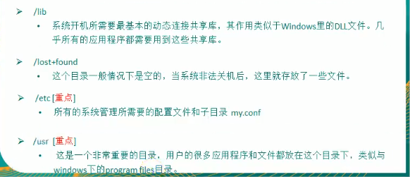

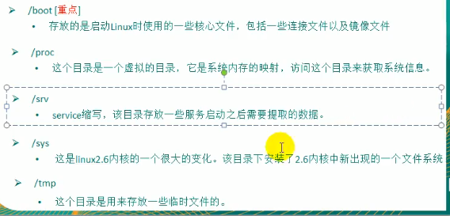

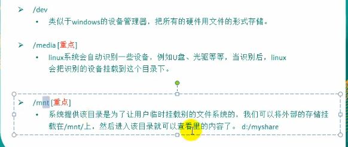

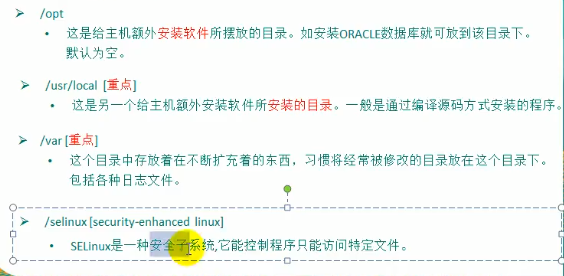

总结：

1）Linux的目录中有且只有一个根目录 /

2）LInux目录存放的内容是规划好的，不要乱动

3）Linux是以文件的形式管理我们的设备，因此在Linux中，一切皆文件!

4)Liinux各个目录下存放的内容要有个大概印象

5）学习后，你的脑海中至少要有linux树

## 三.Linux实操篇

### 1.远程登陆和远程上传下载

需要使用到的软件： Xshell,   XFtp

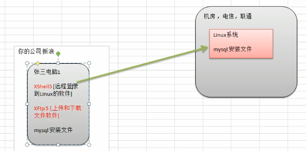

### 2.vi和vim使用

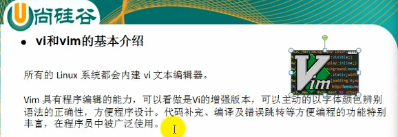

vi和vim的三种常见模式：

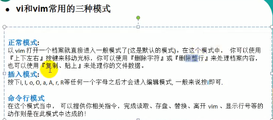


1）正常模式：打开后直接进入的就是正常模式

2)编辑模式:按下i,I,o,O,a,A,r,R等任何一个ie字母之后才会进入到编辑模式，一般都是按i的居多！

3）命令行模式:

这个模式下提供有一些命令操作，包括存盘，退出，查找等！


vim帮助文档：

在终端命令行下输入 `vimtutor`,打开帮助文档

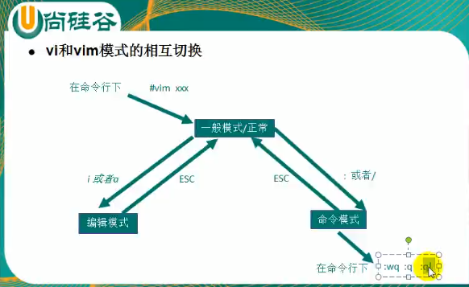

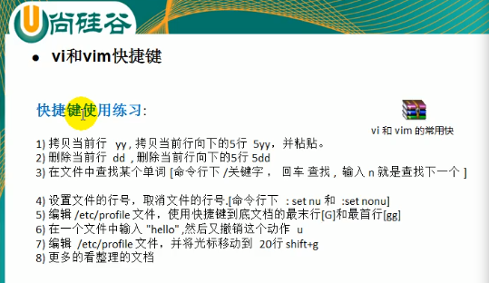

更多快捷键请参考相关手册!!!

### 3.关机重启注销

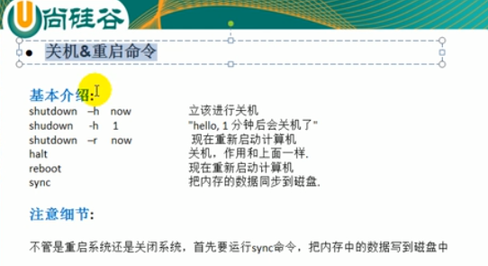

```
# 关机命令
shutdown 
	shutdown -h now     # 立即关机
	shutdown -h 1       # 表示1分钟后关机
	shutdown -r now     # 立即重启

halt
    halt    #  就是直接使用，效果等价于关机

reboot
	reboot    #  重启计算机

sync
	#  是把内存中的数据同步到磁盘中

```

注意细节：当我们关机或者重启时，都应该先执行一下`sync`指令，将数据同步到磁盘中，防止数据丢失!

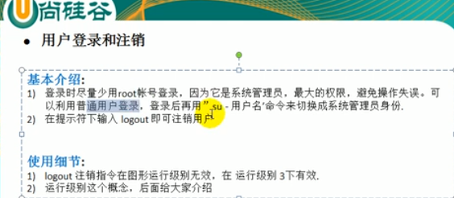

### 4.用户管理

#### 1）基本介绍

用户

用户组

家目录(/home)

每一个用户都至少从属于一个用户组，可以同时从属于多个组

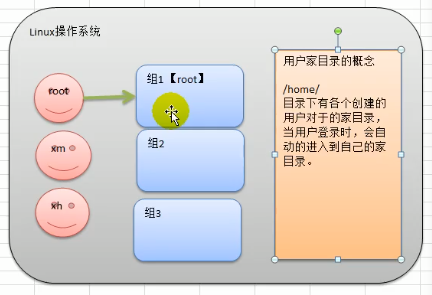

说明：

​       (1)Linux是一个多用户多任务的操作系统，任何一个要使用系统资源的用户，都必须首先向管理员申请一个账      号，然后以这个账号的身份进入到系统才能操作！

​        (2)Linux的用户至少要从属于一个组

#### 2)添加用户

```
# 添加用户 
useradd 
    useradd -- help    # useradd的帮助命令

chenke@chenke-virtual-machine:~/temp$ useradd --help
用法：useradd [选项] 登录名
      useradd -D
      useradd -D [选项]

选项：
      --badnames                do not check for bad names
  -b, --base-dir BASE_DIR       新账户的主目录的基目录
      --btrfs-subvolume-home    use BTRFS subvolume for home directory
  -c, --comment COMMENT         新账户的 GECOS 字段
  -d, --home-dir HOME_DIR       新账户的主目录
  -D, --defaults                显示或更改默认的 useradd 配置
  -e, --expiredate EXPIRE_DATE  新账户的过期日期
  -f, --inactive INACTIVE       新账户的密码不活动期
  -g, --gid GROUP               新账户主组的名称或 ID
  -G, --groups GROUPS           新账户的附加组列表
  -h, --help                    显示此帮助信息并退出
  -k, --skel SKEL_DIR           使用此目录作为骨架目录
  -K, --key KEY=VALUE           不使用 /etc/login.defs 中的默认值
  -l, --no-log-init             不要将此用户添加到最近登录和登录失败数据库
  -m, --create-home             创建用户的主目录
  -M, --no-create-home          不创建用户的主目录
  -N, --no-user-group           不创建同名的组
  -o, --non-unique              允许使用重复的 UID 创建用户
  -p, --password PASSWORD       加密后的新账户密码
  -r, --system                  创建一个系统账户
  -R, --root CHROOT_DIR         chroot 到的目录
  -P, --prefix PREFIX_DIR       prefix directory where are located the /etc/* files
  -s, --shell SHELL             新账户的登录 shell
  -u, --uid UID                 新账户的用户 ID
  -U, --user-group              创建与用户同名的组
  -Z, --selinux-user SEUSER     为 SELinux 用户映射使用指定 SEUSER
      --extrausers              Use the extra users database

 # 显示默认的useradd配置
chenke@chenke-virtual-machine:~/temp$ useradd -D
GROUP=100
HOME=/home
INACTIVE=-1
EXPIRE=
SHELL=/bin/sh
SKEL=/etc/skel
CREATE_MAIL_SPOOL=no

```

细节说明：

(1)当创建用户成功后，默认会自动创建和用户同名的家目录

(2)也可以通过`useradd -d 指定目录 新的用户名`,给新创建的用户指定家目录


#### 3）删除用户

```
[chenke@1f865a20888f ~]$ userdel -h 
Usage: userdel [options] LOGIN

Options:
  -f, --force                   force some actions that would fail otherwise
                                e.g. removal of user still logged in
                                or files, even if not owned by the user
  -h, --help                    display this help message and exit
  -r, --remove                  remove home directory and mail spool
  -R, --root CHROOT_DIR         directory to chroot into
  -P, --prefix PREFIX_DIR       prefix directory where are located the /etc/* files
  -Z, --selinux-user            remove any SELinux user mapping for the user

```

(1)只删除用户，但保留用户的家目录

```
# userdel 用户名
```

（2）彻底删除用户，包括用户的家目录

```
# userdel -R 用户名
```

思考题：是否要保留家目录？

在实际工作中，一般不会将用户的家目录删除掉

#### 4)查询用户信息

```
[root@1f865a20888f home]# id --help
Usage: id [OPTION]... [USER]
Print user and group information for the specified USER,
or (when USER omitted) for the current user.

  -a             ignore, for compatibility with other versions
  -Z, --context  print only the security context of the current user
  -g, --group    print only the effective group ID
  -G, --groups   print all group IDs
  -n, --name     print a name instead of a number, for -ugG
  -r, --real     print the real ID instead of the effective ID, with -ugG
  -u, --user     print only the effective user ID
  -z, --zero     delimit entries with NUL characters, not whitespace;
                   not permitted in default format
      --help     display this help and exit
      --version  output version information and exit

Without any OPTION, print some useful set of identified information.

GNU coreutils online help: <http://www.gnu.org/software/coreutils/>
Report id translation bugs to <http://translationproject.org/team/>
For complete documentation, run: info coreutils 'id invocation'

```

例如，查询chenke的用户信息

```
[root@1f865a20888f home]# id chenke
# 用户id,组id,所在组列表
uid=1000(chenke) gid=1000(chenke) groups=1000(chenke)
```

#### 5）切换用户

```
chenke@chenke-virtual-machine:~$ su -h

用法：
 su [选项] [-] [<用户> [<参数>...]]

Change the effective user ID and group ID to that of <user>.
A mere - implies -l.  If <user> is not given, root is assumed.

选项：
 -m, -p, --preserve-environment      do not reset environment variables
 -w, --whitelist-environment <list>  don't reset specified variables

 -g, --group <组>                指定主组
 -G, --supp-group <group>        specify a supplemental group

 -, -l, --login                  使 shell 成为登录 shell
 -c, --command <命令>            使用 -c 向 shell 传递一条命令
 --session-command <命令>        使用 -c 向 shell 传递一条命令
                                   而不创建新会话
 -f, --fast                      向shell 传递 -f 选项(csh 或 tcsh)
 -s, --shell <shell>             若 /etc/shells 允许，运行<shell>
 -P, --pty                       create a new pseudo-terminal

 -h, --help                      display this help
 -V, --version                   display version

更多信息请参阅 su(1)。

```

最常用的:

```
# 切换用户
su - 用户名

# 返回到原来的用户
exit

# 查看当前我是谁
whoami
```

### 5.用户组管理

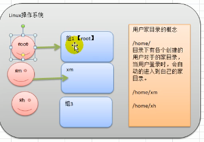


类似于角色,系统可以对有共性的多个用户进行统一的管理

#### 1）增加组

```Linux
[root@1f865a20888f home]# groupadd -h
Usage: groupadd [options] GROUP

Options:
  -f, --force                   exit successfully if the group already exists,
                                and cancel -g if the GID is already used
  -g, --gid GID                 use GID for the new group
  -h, --help                    display this help message and exit
  -K, --key KEY=VALUE           override /etc/login.defs defaults
  -o, --non-unique              allow to create groups with duplicate
                                (non-unique) GID
  -p, --password PASSWORD       use this encrypted password for the new group
  -r, --system                  create a system account
  -R, --root CHROOT_DIR         directory to chroot into
  -P, --prefix PREFIX_DIR       directory prefix

```

案例：创建用户时指定组

```Linux
[root@1f865a20888f home]# groupadd wudang
[root@1f865a20888f home]# useradd zhangwuji -g wudang
[root@1f865a20888f home]# id zhangwuji 
uid=1002(zhangwuji) gid=1002(wudang) groups=1002(wudang)

```


#### 2)删除组

```
[root@1f865a20888f home]# groupdel -h
Usage: groupdel [options] GROUP

Options:
  -h, --help                    display this help message and exit
  -R, --root CHROOT_DIR         directory to chroot into
  -P, --prefix PREFIX_DIR       prefix directory where are located the /etc/* files
  -f, --force                   delete group even if it is the primary group of a user

```

#### 3)修改用户属性

```
[root@1f865a20888f home]# usermod -h
Usage: usermod [options] LOGIN

Options:
  -c, --comment COMMENT         new value of the GECOS field
  -d, --home HOME_DIR           new home directory for the user account
  -e, --expiredate EXPIRE_DATE  set account expiration date to EXPIRE_DATE
  -f, --inactive INACTIVE       set password inactive after expiration
                                to INACTIVE
  -g, --gid GROUP               force use GROUP as new primary group
  -G, --groups GROUPS           new list of supplementary GROUPS
  -a, --append                  append the user to the supplemental GROUPS
                                mentioned by the -G option without removing
                                the user from other groups
  -h, --help                    display this help message and exit
  -l, --login NEW_LOGIN         new value of the login name
  -L, --lock                    lock the user account
  -m, --move-home               move contents of the home directory to the
                                new location (use only with -d)
  -o, --non-unique              allow using duplicate (non-unique) UID
  -p, --password PASSWORD       use encrypted password for the new password
  -R, --root CHROOT_DIR         directory to chroot into
  -P, --prefix PREFIX_DIR       prefix directory where are located the /etc/* files
  -s, --shell SHELL             new login shell for the user account
  -u, --uid UID                 new UID for the user account
  -U, --unlock                  unlock the user account
  -v, --add-subuids FIRST-LAST  add range of subordinate uids
  -V, --del-subuids FIRST-LAST  remove range of subordinate uids
  -w, --add-subgids FIRST-LAST  add range of subordinate gids
  -W, --del-subgids FIRST-LAST  remove range of subordinate gids
  -Z, --selinux-user SEUSER     new SELinux user mapping for the user account

```


