# 计算机网络第5版谢希仁编写 韩立刚老师主讲

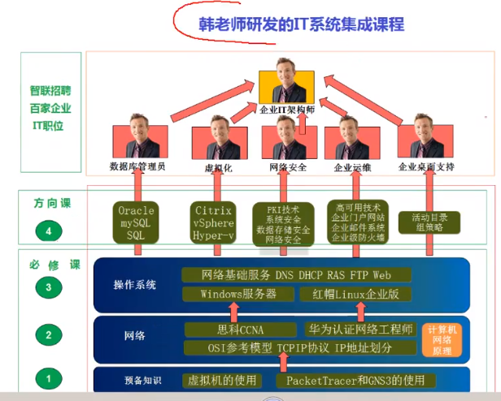

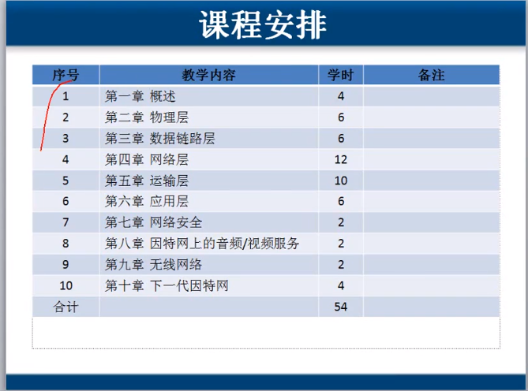

## 一.计算机网络概述

## 1.介绍

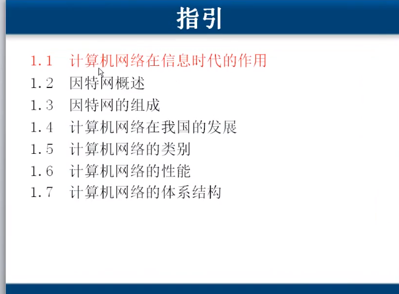

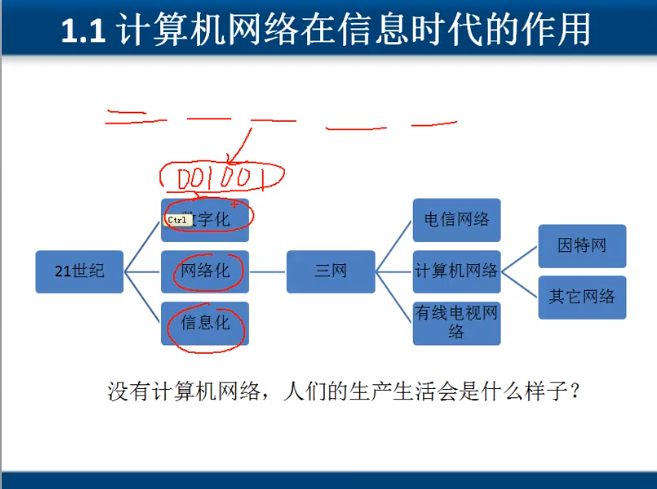

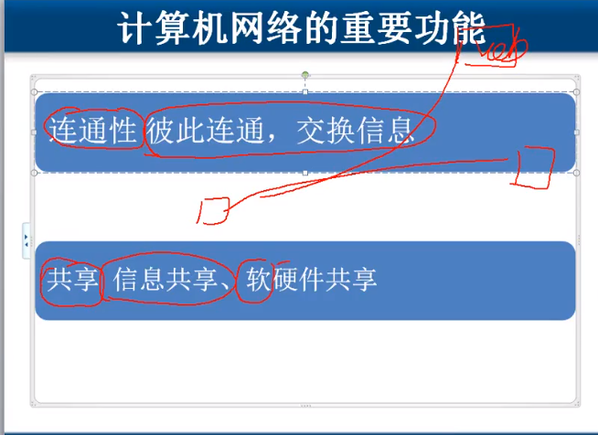

## 2.因特网概述

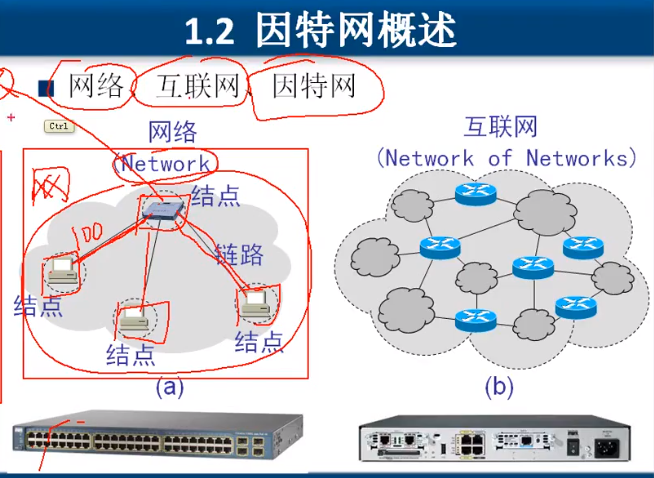

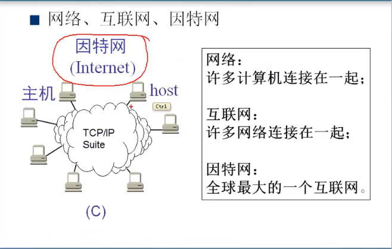

> 网络(netwrok)

这里的网络指的是局域网，覆盖范围大概100米距离，由交换机连接起来

> 互联网(internet)

局域网之间通过路由器连接起来，叫做~

> 因特网(Internet)

因特网：全球最大的一个互联网

**互联网发展的三个阶段**

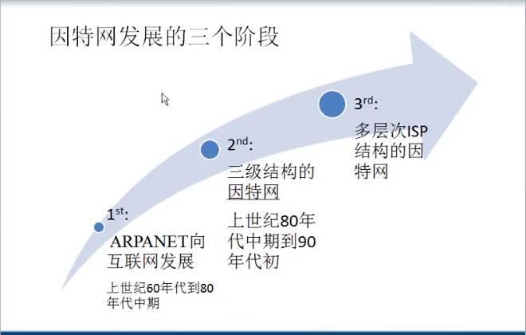

第一阶段：ARPANET向互联网发展,上世纪60年代到80年代中期

第二阶段：三级结构的因特网:上世纪80年代中期到90年代初

第三阶段：多层次ISP结构的因特网

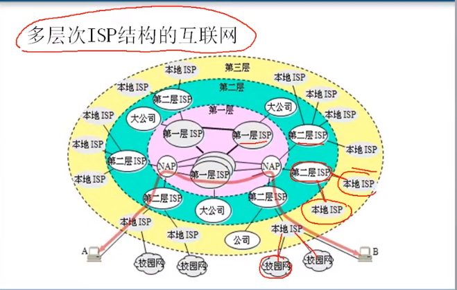

> 中国互联网

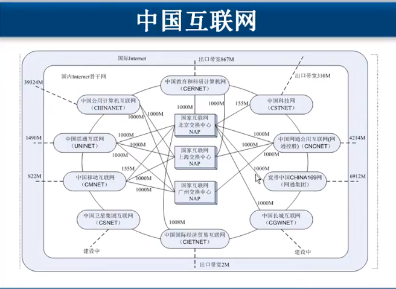

由上图可以看出，不同的运营商提供的带宽服务是不一样的，根据互联网的服务对象和所在地域，来选择合适的运行商，很多网络公司都选择在不同地域放置多台服务器，来满足不同的带宽需求。

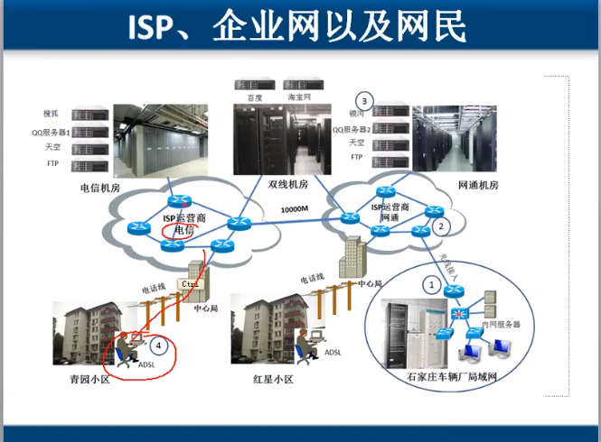

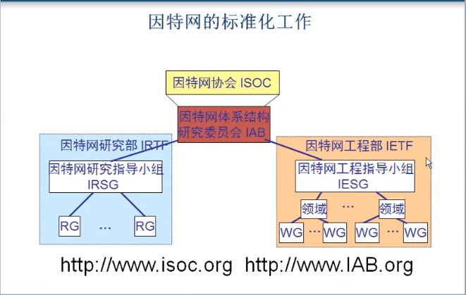

因特网协会 ISOC

因特网体系结构研究委员会 IAB

因特网研究部 IRTF

因特网研究指导小组 IRSG

因特网工程部 IETF

因特网工程指导小组 IESG

## 3.因特网的组成

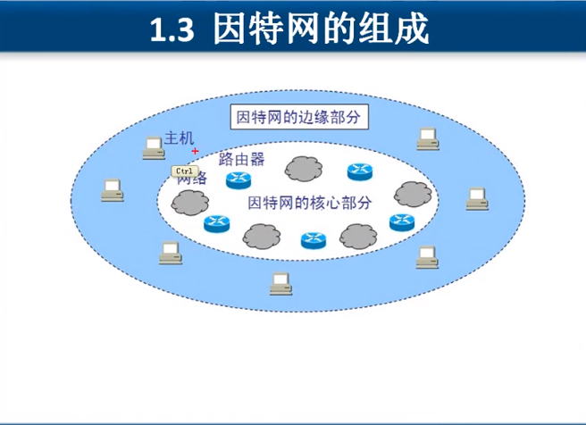

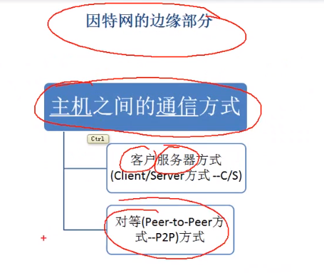

主机之间的通信方式

1.客户服务器方式(Client/Server方式 -- C/S)

2.对等(Peer-to-Peer方式 --P2P方式)

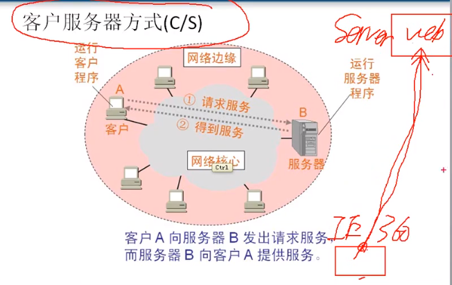

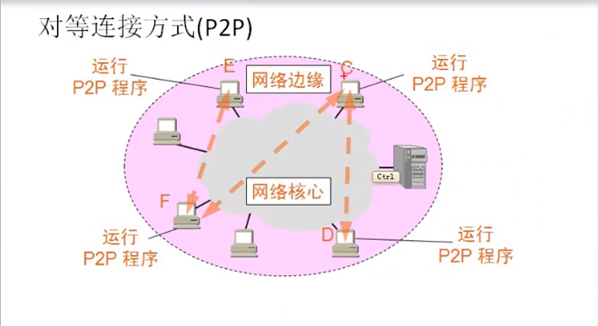

P2P网络，每个主机既是服务器又是客户机

